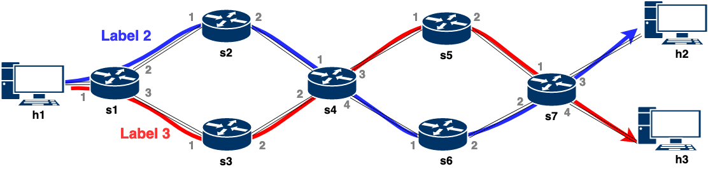
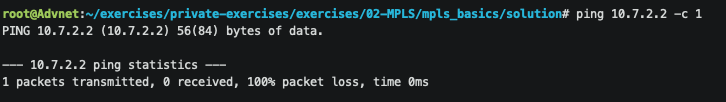
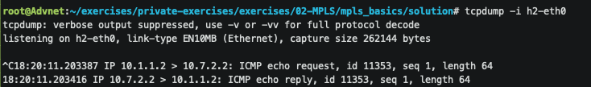
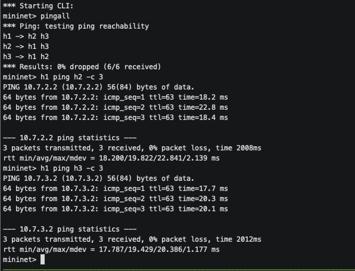
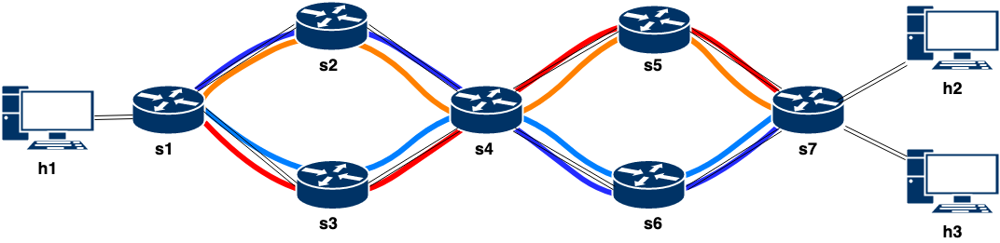

# Multiprotocol Label Switching (MPLS)

在本练习中，您将看到一种不同的转发技术：多协议标签交换。您的最终目标是在数据平面中实现一个 MPLS 转发的基本版本。

MPLS 将标签附加到数据包上以驱动数据包进行转发决策。也就是说，交换机不是根据 IP 地址去转发数据包，而是仅通过查找附加到
数据包上的 MPLS 标签的内容来转发数据包。

正如您将看到的，MPLS 具有许多优点，例如可以为所有类型的数据包创建端到端的路径或对流量工程的扩展性支持。

### MPLS Terminology

在开始之前，我们需要一些词汇来更好地理解这些概念：

- 多协议标签交换 (MPLS)：一种高度可扩展的数据承载机制，独立于任何数据链路层的协议。

- 标签边缘路由器 (LER)：在 MPLS 网络边缘运行的路由器。 LER 确定并应用适当/合适的标签，并将带标签的数据包转发到 MPLS 域。

- 标签交换路由器 (LSR)：交换那些用于通过 MPLS 网络路由数据包的标签的路由器。您可以将 LSR 理解为网络中 “所有” 支持 MPLS 的
  交换机。 LER 也是 LSR。

- 标签交换路径 (LSP)：通过 MPLS 网络的路由，由边界网关协议 (BGP) 等信令协议所定义。该路径是根据转发等价类 (FEC) 中的标准
  所设置的。

- 转发等价类 (FEC)：一组具有相似特征的数据包，可能绑定到相同的 MPLS 标签。

**FEC 往往对应于标签交换路径（LSP）；然而，一个 LSP 可以用于多个 FEC。**
### MPLS Label Encoding

在实际的 MPLS 中，标签堆栈常表示为一个“标签堆栈条目”的序列。每个标签堆栈的条目由 4 个字节所表示：

```bash
Label: Label Value, 20 bits
Exp: Experimental Use, 3 bits
S: Bottom of Stack, 1 bit
TTL: Time to Live, 8 bits
```

每个字段的含义和用于如下所示：

> Label Value: 这 20 bit 的字段携带标签的实际值。当收到带标签的数据包时，将查找堆栈顶部的标签值。成功查找的结果是：
>  * 数据包要转发到的下一跳
>  * 转发前对标签堆栈执行的操作；该操作可以是用另一个条目替换标签堆栈顶部的那个条目，或者从标签堆栈中弹出一个条目，或者替换顶部标签堆栈条目然后将一个或多个额外的条目压入到标签堆栈上。

> Experimental Use: 该三位字段保留供实验使用。

> Bottom of Stack (S): 对于标签堆栈中的最后一个条目（即堆栈底部），该位设置为 1；对于标签堆栈中的所有其他条目，该位设置为零。

> Time to Live (TTL): 该八位字段用于对 time-to-live 值进行编码。

标签堆栈的条目出现在数据链路层报头 **之后**，但在任何网络层报头 **之前**。标签堆栈的顶部 **最早** 出现在数据包中，底部则出现的 **最晚**。网络层数据包紧跟在设置了“S”位的标签堆栈条目之后。

</br>

## 1. Introduction to MPLS

 当数据包从一个路由器传输到下一个路由器时，每个路由器都会对该数据包做出独立的转发决策。选择下一跳可以被认为是两个函数的组合。第一个函数将整个可能的数据包集合划分为一组“转发等价类（FEC）”。第二个将每个 FEC 映射到下一跳。就转发决策而言，映射到相同 FEC 的不同数据包是无法区分的。

在 MPLS 中，将任意的数据包分配给特定的 FEC 只需要执行一次：也就是当数据包进入 MPLS 网络时。数据包分配到的 FEC 被编码为一个短的固定长度值，称为 `label`。当数据包转发到下一跳时，标签也会随之发送；也就是说，数据包在转发到网络之前会被“标记”。

在 MPLS 转发范例中，一旦数据包被分配给 FEC，后续路由器就不再进行进一步的报头分析；所有转发均由标签驱动。

MPLS 主要依赖三个特征：

1) 匹配动作表，其负责将各种类型的数据包映射到所需标签（即 FTN）。
2) 标签，其由数据包携带的。
3) 匹配动作表，其负责将标签映射到某个出口端口以执行转发（即 NHLFE）。

> **FEC 到 NHLFE 的映射 (FTN)** 将每个 FEC 指向一个 NHLFE（或应用流量工程时的一组 NHLFE）。它用于转发到达时未标记，但在转发之前要标记的数据包。
> **标签**是一个短的、固定长度的、局部有效的标识符，用于标识某个 FEC。每个标签交换路由器 (LSR) 都有责任确保它能够唯一地解释传入的标签。
> **下一跳标签转发条目 (NHLFE)** 在转发一个被标记的数据包时使用。它包含有关数据包的下一跳的信息。

</br>

## Exercise: Implementing the MPLS Basics

 在练习的第一部分中，您的任务将是实现一个模拟的 MPLS 架构。在这个模拟架构中，我们将为每个数据包分配一个标签。这些标签将由入口 LER 施加，并且具有全局意义。简而言之，这个模拟的 MPLS 架构将每个 FEC 编码为对应的标签。
### Before starting

正如我们按顺序进行练习一样，我们为您提供了一些文件来帮助您完成练习。

- `p4app.json`: describes the topology that you will use throughout the exercise.
- `network.py`: a Python scripts that initializes the topology using *Mininet* and *P4-Utils*. One can use indifferently `network.py` or `p4app.json` to start the network.
- `p4src/basics.p4`: 包含 p4 程序框架，您将使用它作为练习第一部分（模拟 MPLS）的起点。
- `p4src/stacked.p4`: 包含 p4 程序框架，您将使用它作为练习第二部分（实际 MPLS）的起点。

**Note**: This time you will not be able to run `p4run` until you finish some of the `TODOs`.

在本练习中，您将使用以下拓扑。您的目标是通过实现 MPLS 的不同功能来实现从 h1 到 h2 和 h3 的通信。

<p align="center">

<p/>

### Task 1. Adding MPLS-label support

1. 创建一个新的 `etherType` 以表示 MPLS 协议. LERs 将使用这个 `etherType` 来检测 MPLS 数据包. 正如 `TYPE_IPv4` 一样, `TYPE_MPLS` 将拥有 16bits 的大小. 您可以选择您想要的值。如果您想遵循标准，请使用 `0x8847`。

2. 为 MPLS 标签创建一个报头类型。报头应具有如上所述的 4 个字段 [above](#mpls-label-encoding)。报头堆栈中的每一层都应该有一个名为 `label` 的 20bits 字段、一个名为 `exp` 的 3bits 字段、一个名为 `s`（堆栈底部）的 1bit 字段和一个名为 `ttl`的 8bits 字段

3. 实例化结构体 `headers`，其包括您刚刚创建的 MPLS 报头。请注意，MPLS 报头将位于 IPv4 报头和以太网报头之间。
   
4. 创建一个解析器“parse_mpls”，每当收到 MPLS 数据包时，它都会提取 MPLS 报头。
   
5. 如果检测到 MPLS 数据包，则调用该解析器。您可以使用您创建的常量 `TYPE_MPLS` 来了解以太网数据包是否包含 MPLS 报头，或者是仅包含 IPv4。

### Task 2. Setting packet labels from ingress switches (s1)

实现允许入口交换机 (s1) 在数据包中添加额外报头的功能，该报头将用作路径上的标签。

首先，您需要识别访问 MPLS 网络的数据包。为此：

1. 请注意，我们创建了两个元数据字段 `is_ingress_border` 和 `is_egress_border`，这将帮助我们识别从**入口交换机**（即数据包**访问 MPLS 网络**的交换机）以及来自**出口交换机**（即数据包**离开 MPLS 网络**的交换机）的数据包并处进行理。

2. 创建一个新表 `check_is_ingress_border`，用于检查数据包的入口端口是否对应于 MPLS 网络的条目。该表应该（精确）匹配 `standard_metadata.ingress_port`，并且应该在命中时执行`set_is_ingress_border`动作。

3. 创建 `set_is_ingress_border` 动作，每当该动作执行时会将 `is_ingress_border` 元数据字段设置为 1。

4. 如果您查看 `s1-commands.txt`，您可以看到我们如何为您填充 `check_is_ingress_border` 表条目。在这种情况下（交换机 s1），所有从端口 1 进入（即来自 h1）的数据包都将到达该条目，因此将被识别。

```
table_add check_is_ingress_border set_is_ingress_border 1 =>
```

交换机 s1 必须充当这些数据包的 ingress_border 交换机，并向它们添加 MPLS 报头，根据其转发等效类 (FEC) 选择最佳标签。实现此功能将是您的下一个任务。我们已经为您提供了入口管道的代码。看一下它并确保您理解其中的逻辑。

```
apply {

  // We check whether it is an ingress border port
  check_is_ingress_border.apply();

  if(meta.is_ingress_border == 1){

      // We need to check whether the header is valid (as mpls label is based on dst ip)
      if(hdr.ipv4.isValid()){

          // We add the label based on the destination
          fec_to_label.apply();
      }
  }
```

正如您所看到的，代码只是检查交换机是否应该充当入口交换机，如果应该，则应用表 `fec_to_label`。该表将负责选择相应的 MPLS 标签并将其添加到数据包中。

**我们将添加哪些 MPLS 标签?** 我们想要创建两个转发等效类 (FECs)：一种用于发往 h2 (10.7.2.2) 的数据包，另一种用于发往 h3 (10.7.3.2) 的数据包。为了做到这一点：

5. 创建 `fec_to_label` 表. 它应该 (lpm-) 匹配 `hdr.ipv4.dstAddr`，并且应该在命中时执行 `add_mpls_header` 动作，将与其匹配的 FEC 相对应的标签作为参数进行传递。您应该使用两个不同的标签值来识别两个 FEC 中每一个的数据包。

6. 修改 `s1-commands.txt` 文件以包含两条路径. 如果你使用标签 2 和 3， 你可以按如下方式进行填充：

```
table_add fec_to_label add_mpls_header 10.7.2.2/32 => 2
table_add fec_to_label add_mpls_header 10.7.3.2/32 => 3
```

7. Let's add that functionality!此时，入口交换机知道如何根据目的IP地址添加MPLS标签。然而，它仍然不知道将数据包发送到哪个端口。让我们添加该功能！

### Task 3. Forwarding packets based on labels

实现下面两个功能 (i) 允许交换机从数据包报头中读取标签，以及 (ii) 使用标签相应地转发数据包的。为此：

1. 取消入口管道的最后几行注释。请注意，命令 `isValid()` 用于检查处理后的数据包是否包含 MPLS 报头。如果是包含该报头，则读取标签并相应地转发数据包。

```
// We select the egress port based on the mpls label
if(hdr.mpls.isValid()){
    mpls_tbl.apply();
}
```

2. 创建 `mpls_tbl` 表，该表与 `mpls` 报头中的标签字段（精确）匹配，并调用 `mpls_forward` 动作，以相应地设置 MAC 地址和出口端口。我们已经为您提供了动作以及 `s1` 的表条目作为示例。请注意，交换机之间的 `mac` 地址并不重要，因为它们不会被检查，但是当数据包发送到真实主机时，`mac` 则必须匹配。如果不是这种情况，数据包将被丢弃并且无法到达应用层，例如 `ping` 或 `iperf`。
   
```
table_add mpls_tbl mpls_forward 2 => 00:00:00:02:01:00 2
table_add mpls_tbl mpls_forward 3 => 00:00:00:03:01:00 3
```

3. 填写路径中其他交换机的 `sx-commands.txt` 相应的条目。您的目标是数据包遵循拓扑图中指示的路径。与发往 h2 的数据包对应的 FEC 应遵循蓝色路径，而发往 h3 的数据包所对应的 FEC 应遵循红色路径。

4. 为了能够在 `h2` 和 `h3` 之间进行 ping 操作，我们需要向交换机添加正常的 `ipv4` 转发功能。为此，创建一个与 `ipv4.dstAddr` 匹配（具有 lpm 匹配）的 `ipv4_lpm` 表，并调用 `ipv4_forward` 动作。最后，取消注释从入口管道中的 `apply` 函数执行此表的代码行（查找 TODO 3.4）。

5. 创建当使用普通 `ipv4` 转发时调用的 `ipv4_forward` 动作。该动作将目的 MAC 地址和出口端口作为参数。在此动作中，将先前的目的 MAC 地址设置为源以太网地址（MAC 交换），并使用该动作的输入参数设置新的目的 MAC 地址。然后设置出口端口，并减小 TTL。

6. 由于您修改了 IP 报头的 TTL 字段，并且 IP 报头具有校验和字段，因此需要重新计算检验和。由于这是您第一次必须计算校验和，因此我们已经为您提供了相关实现。您只需取消注释代码并了解它的作用即可。
   
7. 使用每个交换机输出的 `tcpdump` 或 pcap 日志文件来验证您的转发行为是否按预期工作。到目前为止，您的数据包应该到达 `s7`。

### Task 4. 从出口交换机移除数据包的标签 (s7)

扩展相应的功能，以允许最后一个交换机（`s7`）在决定转发后删除数据包的报头，解析数据包并转发。

1. 就像您已经能够标识那些充当 MPLS 网络入口的交换机一样，现在您必须标识相应的出口交换机。创建一个与 `standard_metadata.egress_port` 参数进行精确匹配的表 `check_is_egress_border`，并在命中时执行`is_egress_border()` 动作。请注意，您只能从出口管道获取数据包将要转发到的 egress_port，因为执行转发决策的是流量管理器。

2. 查看 `is_egress_border()` 动作所做的操作.

```
action is_egress_border(){
    hdr.mpls.setInvalid();
    hdr.ethernet.etherType = TYPE_IPV4;
    hdr.ipv4.ttl = hdr.ipv4.ttl - 1;
}
```

正如您可能已经猜到的，它正在删除 MPLS 报头。在 p4 中，通过使用 `setInvalid()` 命令将报头设置为无效从而实现报头的删除。当数据包在被逆解析时，逆解析器将发现该报头无效，并且不会发出/提交它。还要注意将 EtherType 设置回 `TYPE_IPV4` 的重要性，以便 MPLS 网络外部的路由器可以正确解析数据包。此时，离开 MPLS 网络的数据包应该与进入 MPLS 网络的数据包完全相同（即，MPLS 网络执行的所有数据包处理对外部来说都是完全透明的）。

3. 填充 `s7-commands.txt` 文件中的表项.

4. 此时，您应该已经能够从 h1 向 h2 和 h3 发送 ping 请求。您可以从两个接收主机中的每一个运行 `tcpdump` 来查看结果：(`tcpdump -enn -l -i <interface_name>`)

From h1:
<p align="center">

<p/>

From h2:
<p align="center">

<p/>

尽管 ping 请求同时到达 h2 和 h3，但它们各自的 ping 响应仍然没有返回到 h1。

### Task 5. Enabling bidirectional communication

现在您的任务是修改现有解决方案，以便 h2 和 h3 的 ping 响应返回到 h1。为此：

1. 首先，让 h2 和 h3 的响应遵循蓝色路径：`s7->s6->s4->s2->s1->h1`。为此，请为目的地为 h1 (10.1.1.2) 的所有数据包创建/分配一个 FEC。您可以使用一个新的标签（例如 1）来表示所有交换机上的此类流量。请注意，您不需要对 p4 代码本身进行任何更改。您唯一需要做的就是在 `sx-commands.txt` 文件中添加更多的表条目。不要忘记将 s7 配置为入口边界交换机，用于入口端口分别为 3 和 4 的数据包；并将 s1 配置为出口边界交换机，用于从出口 1 离开的数据包。请注意，`sx-commands.txt` 只能在交换机初始化时读取。因此，要更新交换机的表条目，您可以再次重新运行此网络，也可以在 mininet `cli` 中输入 `p4switches_reboot`。

2. 通过从 h1 ping h2 和 h3 来测试您的解决方案是否正常工作。您应该看到响应能够正确返回到 h1，并且数据包的丢失率为 0 %，如下图所示。请随意使用其他工具（例如 `iperf`）来进一步测试您的实现。您可以在[此处](https://iperf.fr/iperf-doc.php)找到有关 `iperf` 的更多详细信息。如果您实现了允许 `h2` 与 `h3`对话的 `ipv4_lpm`，您可以使用 `pingall` 来测试您的解决方案，它将测试每个主机是否可以 ping 到所有其他主机。

<p align="center">

<p/>

3. (Optional) 现在，使每个 ping 响应遵循与其对应的 ping 请求相同的路径。为了实现这一点，您需要将两种类型的流量分隔到两个不同的 FEC 中。请注意，现在，仅在 `hdr.ipv4.dstAddr` 进行匹配不足以区分两个 FEC。 *提示：同时使用 `hdr.ipv4.srcAddr` 和 `hdr.ipv4.dstAddr` 怎么样？*

</br>

## 2. Introduction to MPLS Label Stacking

 到目前为止，我们已经实现了 MPLS 的模拟版本，其中数据包仅携带一个（全局）标签，该标签应该可由 MPLS 域中的所有交换机进行唯一的解释。然而，在实际的 MPLS 中，交换机可能会在本地去解释标签。

MPLS 网络的 LER 知道这些本地解释的标签。每当新的数据包进入 MPLS 网络时，相应的入口 LER 都会附加 LSP 上的交换机将使用的所有的数据包标签。这些标签将被组织为报头堆栈，以便每个标签代表堆栈中的一个不同层。沿途的交换机读取其相应的标签值，根据标签选择如何转发数据包，然后将其从堆栈中删除（弹出）。重复同样的过程，直到数据包到达倒数第二个LSR，该LSR最后一次根据标签转发数据包，并从堆栈中删除最后一个标签。需要注意的是，出口 LER 会接收到正常的 IPv4 数据包，并根据目的 IPv4 地址去转发它。

为了说明跨交换机使用本地标签而不是全局标签的好处，请考虑我们拓扑中的交换机 `s4`。

* 为了遵循 **全局标签策略**，`s4` 需要识别拓扑中所有可能的路径。特别是，对于两个可能的方向：`s1 到 s7` 和 `s7 到 s1`，每个方向都需要 4 个不同的标签（`dark blue`, `light blue`, `red`, and `orange`），这样总共就有 8 个标签。正如您可以评估的那样，可能的路径数量随着拓扑尺寸的增加而急剧增加，所需的全局标签的数量也随之增加。从可扩展性的角度来看，这使得全局标签变得非常不利。

* 通过 **本地标签策略**，`s4` 只需要支持其可能的转发选项的标签。对于这一特定拓扑，只有 4 个标签（即 4 个端口中的每一个端口都有一个不同的标签）。与 `s4` 对应的标签不会携带整个（端到端）路径的信息，而是仅携带有关如何在该交换机内转发数据包的信息。

您可能已经意识到，MPLS 标签堆栈也并非一帆风顺。构建报头堆栈需要入口 LER 拥有整个拓扑的完整转发信息，就像全局单标签版本一样。此外，生成的 MPLS 报头堆栈的大小随着特定路径中的跳数呈线性增长。但好的一面是，标签的范围受到每个交换机上可能的转发选项的限制，从而导致 MPLS 转发表较小。

<p align="center">

<p/>

</br>

## Exercise: Implementing MPLS Label Stacking
 在练习的第二部分中，您的任务将是实现更高级的 MPLS 架构，以在数据平面中启用标签堆栈功能。特别是，您需要设计一个 P4 程序，其中：

**Ingress border switches:**
* 根据与`h1`, `h2` 和 `h3` 对应的转发等效类 (FEC) 去识别流量。
* 创建 MPLS 报头堆栈并将它们附加到定向到这些目的地的数据包上。
* 根据堆栈中最上面的标签去转发数据包。

**Non-LER switches:**
* 识别 MPLS 数据包并从堆栈的最上层提取 MPLS 标签。
* 根据该标签中包含的信息转发数据包，并在转发之前将最上层的条目弹出。

**Penultimate switches:**
* 识别 MPLS 数据包并从堆栈的最上层提取 MPLS 标签。
* 根据该标签中包含的信息转发数据包。
* 弹出堆栈中最上面（同时也是最后）的层。
* 在转发数据包之前将 `etherType` 设置回 IPv4。

**Egress border switches:**
* 仅基于IPv4原则转发数据包。

### Task 1. Add MPLS Label Stacking support:

1. 为 MPLS 协议创建一个新的 etherType，即 `TYPE_MPLS`，这将用于从以太网报头中标识/识别该协议。您可以复制上一节中实现的那个。使用与上一个练习相同的方法。

2. 定义 `mpls_t` 报头. 您可以复制上一节中实现的那个。

3. 请注意，现在我们没有 `is_ingress_border` 或 `is_egress_border` 元数据字段。由于我们现在有了堆栈底部 `s` 这个报头字段，交换机可以检测它们是否是 MPLS 网络的最后一跳。

4. 将新定义的 `mpls_t[CONST_MAX_MPLS_HOPS]` 报头添加到结构体 `headers` 中。请注意如何使用 `[CONST_MAX_MPLS_HOPS]` 来表示报头堆栈。该数据结构将保存一个 mpls 报头数组，您可以使用一个数组索引来访问该数组。然而，对于本练习，我们将仅使用堆栈顶部的 mpls 报头。

5. 如果检测到以太类型 `TYPE_MPLS`，则调用 MPLS 解析器。正如您在上一个练习中所做的那样。

6. 创建一个解析器来提取 MPLS 报头堆栈的所有层。正如您在之前的练习中所看到的，为了解析来自线路的数据包的各个字节并将其转换为实际对应的报头，我们执行类似 `packet.extract(hdr.ethernet)` 的操作。这会将数据复制到 `ethernet` 报头。当解析报头堆栈时，会有着不同的操作效果。例如：`packet.extract(hdr.mpls.next)`。 `next` 关键字将允许您能够多次在 `hdr.mpls` 字段上使用提取字节并将它们存储在下一个数组的位置中。当您想使用刚刚解析的字段之一时，例如要进行解析器状态转换时，您可以使用 `transition select(hdr.mpls.last.s)`。这将对您解析的最后一个 mpls 报头执行选择操作。最后，通过检测每一层中堆栈底部标志，并在到达底部时转换到 `parse_ipv4`。要解析整个 MPLS 堆栈，您的解析器逻辑需要不断调用自身，直到找到堆栈底部。

7. 在继续之前，请了解入口控制块、`FEC_tbl` 和 `mpls_tbl`。它们已经完全提供，并且阐明了本节其余部分的 TODO 分配。第一个表`FEC_tbl` 基本上用于入口和出口交换机（取决于匹配的操作）。第二个表 `mpls_tbl` 仅在数据包携带 MPLS 报头时应用，用于使用 MPLS 标签转发数据包，该表有两个操作: 1) 正常的mpls转发，2) 倒数第二个 mpls 转发，确保数据包类型设置为 `ipv4`。

### Task 2. Complete the remaining actions:

1. 让我们开始分析我们的入口控制块。该块以该条件作为开始：`if(hdr.ipv4.isValid() && hdr.mpls[0].isInvalid())`。仅当有 IPv4 数据包到达交换机时才会发生这种情况。这种情况发生在两种情况下：交换机是入口 MPLS 交换机，或者是出口 MPLS 交换机。如果我们查看 `FEC_tbl` 的定义，则会涉及两种类型的操作：`ipv4_forward` and `mpls_ingress_1_hop`。分析 `mpls_ingress_1_hop` 这个动作，然后自己实现`mpls_ingress_2_hop`、`mpls_ingress_3_hop`、`mpls_ingress_4_hop`、`mpls_ingress_5_hop`，这样代码也可以支持不同路径长度的拓扑。
2. 提示：只需仔细复制 `mpls_ingress_1_hop` 的内容即可实现 `mpls_ingress_x_hop`。您只需要多次使用`hdr.mpls.push_front(1)` ，并相应地设置堆栈底部（仅一次）。请注意压入 mpls 报头的顺序，前面压入的最后一个报头将是报头堆栈中的第一个报头。例如，如果您按顺序依次压入 label1、label2 和 label3，则 label3 将是报头堆栈中的第一个，而 label1 应该是最后一个。

3. 理解 `mpls_tbl` 做了什么. 完成 `mpls_forward` 和 `penultimate` 动作的修改. 

    1. 在 `mpls_forward`, 你需要做如下几个:
         * 设置出口端口,
         * 相应地更新数据包的 MAC 地址（就像第 3 层路由器所做的那样），
         * 减少第一个 mpls 报头的 TTL 并将其(减少后的TTL)复制到第二个报头（您可以使用 `hdr.mpls[0]` 访问当前报头，使用 `hdr.mpls[1]` 访问下一个报头），
         * 最后，从顶部弹出一个报头.

    2. In `penultimate`, you need to:
         * 将数据包转换回 `IPV4`。对于更改以太网 `ethertype`，相应地更新 MAC 地址（就像第 3 层路由器所做的那样），
         * 将 `ipv4` 的 ttl 设置为最后一个 mpls 报头中的 ttl - 1，
         * 最后，设置出口端口并弹出最后一个 mpls 报头。

### Task 3. Enable communication between h1, h2, and h3:

完成数据平面的编程后，您现在应该填写 `sx-commands.txt` 中的表的条目以使网络正常工作。与上一节相同，您会发现 7 个不同的命令文件，每个命令文件对应拓扑中的每个交换机。在这些中，我们已经为 `h1 -> h2` 连接提供了必要的条目。您的任务是：(i) 了解所提供的条目，以及 (ii) 使用所需的表条目完成命令文件，以便可以在拓扑中的任意两台主机之间进行双向通信。

1. 完成 `sx-commands.txt` 文件的填写.

### Task 4. Test your solution:

1. Use the `pingall` command from Mininet to verify whether you have connectivity between `h1`, `h2`, and `h3`.

### Task 5. (Optional) Bonus:

1. 使用彼此之间具有不同跳数的不同主机创建您自己的拓扑。修改你的解决方案。
