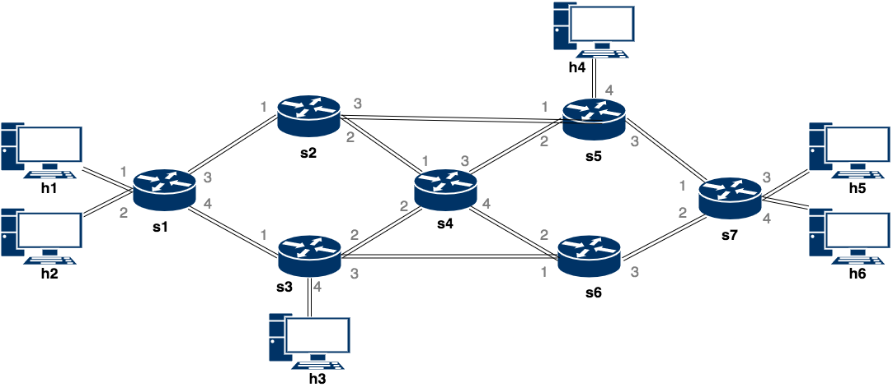
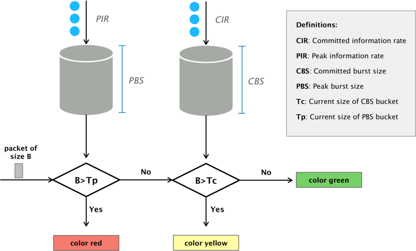
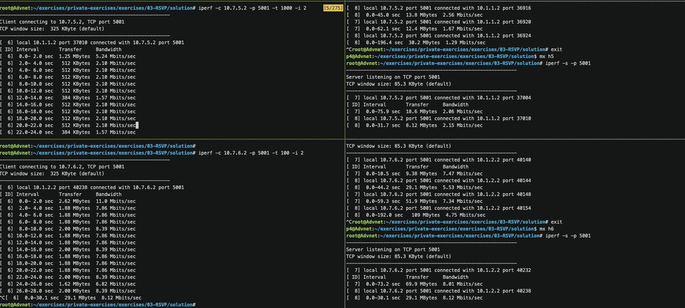

# Traffic Engineering with RSVP (I)

> **IMPORTANT:** This exercise builds upon the [MPLS Stacked](../../04-MPLS/thrift/mpls_stacked).
> Make sure that your MPLS stacked implementation works before
> continuing.

In this exercise, we will extend your MPLS (stacked) implementation with RSVP
capabilities.

## Introduction to (Simplified) RSVP

资源预留协议（Resource Reservation Protocol，RSVP）允许发送者通过网络预留到目的地的资源（例如带宽）。
如果预留被授予，即路径中的所有路由器都将所请求的带宽分配给此流，则发送方可以按请求的速率发送流量，并且
没有其他流可以占用该带宽。

对于本练习，我们将实现一个具有以下属性的简化和自定义版本：

- 源主机 S 通过联系中央控制器 C 为到目的地 D 的单向流（由源和目标 IP 地址标识）预留资源。
- 预留（`Resv`）消息包含以下属性：
  - `src`: 源 IP 地址
  - `dst`: 目的 IP 地址
  - `bw`: 请求的带宽(单位: Mbps)
  - `t`: 流的间隔 (单位: s)
  - `p`: 预留的优先级 (越高越好)
- 预留通过一个 CLI 接口发送到中央控制器。
- 超时后，预留将自动失效。
- 控制器授予预留、配置交换机并在超时后删除相应的预留。转发流的数据包的行为发生在数据平面中，
  而不涉及控制器（使用 MPLS）。
- 如果没有（授予的）预留，则无法通过网络发送流量。因此，要将流量从 S 发送到 D 以及从 D 发送回 S，
  需要两个预留（每个方向各需要一个）。唯一的例外是 S 和 D 连接到同一交换机时。然后，则无需预留即可进行通信。
- 控制器可以访问所有交换机并可以修改其配置（包括匹配操作表条目）。

## Before Starting

我们为您提供一些文件来帮助您完成练习。

Amongst others, you will get these files:
- `p4app.json`: describes the topology that you will use throughout the exercise. See the figure below. We also added `p4app-simple.json` topology in case you want to use a smaller (triangle) topology.
- `network.py`: a Python scripts that initializes the topology using *Mininet* and *P4-Utils*. One can use indifferently `network.py` or `p4app.json` to start the network.
- `rsvp_controller.py`: skeleton for the controller (your task will be to implement the missing pieces).
- `cli.py`: 与控制器进行交互的 CLI (已经实现)

请注意，这次我们不提供 P4 模板，因为您将重复使用上一个（MPLS 堆栈）练习中的代码。因此，将此代码复制到 `rsvp.p4` 中（如果您没有完成 MPLS 练习，请立即继续）：

### Network Topology

对于本练习，我们为您提供了如下所示拓扑的示例配置。不过，您也可以随意使用您自己的拓扑来测试您的解决方案。
例如，在开发解决方案时，您可以使用带有 2-3 个交换机的非常小的拓扑，一旦有了工作原型，就可以转向更大的拓扑。

<p align="center">

<p/>

每个链路的带宽设置为 10 Mbps（请参阅“p4app.json”）。

### Control Plane

本练习的重点不是数据平面实现（您将使用 [MPLS 堆栈代码](../../04-MPLS/p4runtime/mpls_stacked) 并进行少量修改），而是控制平面。首先，我们在 `rsvp_controller.py` 中为您提供了控制器的代码框架。

该框架已经实现了以下功能：
- 与所有的交换机进行连接 (`self.connect_to_switches()`)
- 所有链路及其容量的列表 (`self.build_links_capacity()`). 
- 拓扑为 networkx 图 (`self.topo.network_graph`)
- 获取两个节点之间的所有路径的函数 (`self.get_sorted_paths(src, dst)`)
- A CLI (`cli.py`)

### Running the Controller

为了启动控制器 CLI, 首先使用 `sudo p4run` 来启动拓扑，然后只需运行：
```bash
python rsvp_controller.py
```

这将启动我们为该练习制作的 CLI，您可以在其中运行一组不同的命令，这些命令在您实现之前不会执行任何操作。
您可以输入 `help` 来查看命令（最重要的命令包括 `add_reservation` 和 `del_reservation`）。

### Performance Optimizations

为了测试我们实现的性能，我们需要通过交换机发送数十万个数据包。下面，我们将解释如何提高 `bmv2` 的性能以实现更高的吞吐量。

#### Disabling Debugging in the bmv2 Switch
正如您在前面的练习中已经看到的，如果您在两个直接连接的主机之间执行 `iperf`，您将获得大约 `15~20mbps` 的带宽。为了能够快速地将数据包发送到交换机，我们可以使用不同的名称再次克隆存储库，并使用不同的标志对其进行编译。由于此过程最多可能需要 10 分钟，因此您可以让它在后台运行。
```bash
cd ~/p4-tools/
git clone https://github.com/p4lang/behavioral-model.git bmv2-opt
cd bmv2-opt
git checkout 62a013a15ed2c42b1063c26331d73c2560d1e4d0
./autogen.sh
./configure --without-nanomsg --disable-elogger --disable-logging-macros 'CFLAGS=-g -O2' 'CXXFLAGS=-g -O2'
make -j 2
sudo make install
sudo ldconfig
```
**IMPORTANT:** 建议您在找到可行的解决方案之前不要运行 `sudo make install` 命令。当使用这种优化编译时，交换机不会生成日志文件，因此您将很难去正确调试程序。由于我们将 `bmv2` 的两个编译版本保存在不同的文件夹中，因此您只需再次运行 `make install` 命令即可启用启用了 `debugging` 的版本：

```bash
cd ~/p4-tools/bmv2
sudo make install
sudo ldconfig
```

因此，通过在 `~/p4-tools/bmv2` 或 `~/p4-tools/bmv2-opt` 中运行 `sudo make install`，您可以轻松启用每个编译版本。

### Some Notes on Debugging and Troubleshooting

此时您可能知道如何调试程序。无论如何，我们在文档部分添加了一个[小指南](https://github.com/nsg-ethz/p4-learning/wiki/Debugging-and-Troubleshooting)。当事情没有按预期进行时，可以将其用作参考。

## Part 1: RSVP without Bandwidth Guarantees

对于这个由两部分组成的练习的第一部分，我们将实现一个功能性的 RSVP 控制器。完成这部分后，我们应该能够通过控制器的 CLI 去添加/删除预留。控制器应考虑对 `src`, `dst`, `duration` 和 `bw` 进行分配。因此，对于这一部分，将不会使用 `priorities`。此外，虽然控制器在进行路径分配时会考虑预留 `bandwidth`，但实际上我们仍然不会对其进行速率限制。

## Configure MPLS from the Controller

在开始 RSVP 之前，我们将像之前的练习 (mpls_stacked) 一样配置 MPLS 网络中的交换机。为此，我们使用上一个练习中的 MPLS 实现，并稍作修改：控制器现在动态添加这些条目，而不是通过 `sX-commands.txt` 文件中的静态条目去000配置交换机。

### Task 1: Fix the FEC Table

作为与 MPLS 实现相比的一个小修改，我们需要修改 `FEC_tbl` 表的结构来解决以下问题：由于该表当前仅匹配目的 IP 地址，因此交换机会将流量转发到目的地，而不管源地址，但这不是 RSVP 应该做的。为了解决这个问题，我们还需要对源 IP 地址进行匹配，并修改表结构，如下所示：

我们基本上将 `ipv4.srcAddr` 添加到匹配键中，并且您可以选择扩展 `mpls_ingress_X_hop` 动作以支持更多跳：

```
table FEC_tbl {
    key = {
        hdr.ipv4.srcAddr: lpm;
        hdr.ipv4.dstAddr: exact;
    }
    actions = {
        ipv4_forward;
        mpls_ingress_1_hop;
        mpls_ingress_2_hop;
        mpls_ingress_3_hop;
        mpls_ingress_4_hop;
        mpls_ingress_5_hop;
        mpls_ingress_6_hop;
        mpls_ingress_7_hop;
        mpls_ingress_8_hop;
        NoAction;
    }
}
```

> 注意：bmv2 只允许每个表进行一次 `lpm` 匹配，稍后您将了解为什么我们在源 IP 上进行 `lpm` 匹配 (其实是方便转发目的 IP 为某个主机的所有流量)。

### Task 2: Install Rules for MPLS Forwarding

在此任务中，我们将仅配置交换机以根据 MPLS 标签和 IP 地址去转发流量。稍后，我们将添加配置以将标签堆栈压入到那些进入到入口交换机的数据包上。换句话说，我们将自动填充 `mpls_tbl` 和 `FEC_tbl` 表的 `ipv4_forward` 动作。

请记住，在 MPLS 练习中，我们需要添加以下条目：

- 对于每个主机，我们需要一条规则来转发来自其所连接的交换机的流量。例如：（请参阅我们有 0.0.0.0/0 作为源匹配）。
  请注意，最长前缀匹配 `0.0.0.0/0` 将匹配每个 IP。
  ```
  table_add FEC_tbl ipv4_forward 0.0.0.0/0 10.0.0.1 => 00:00:0a:00:00:01 3
  ```

- 对于每一对连接的交换机（双向），我们需要规则来基于 MPLS 标签去转发流量。此外，对于每个条目，对于堆栈底部为 `1` 的情况，
  我们将需要一个副本（在这种情况下，我们必须调用 `penultimate`）。例如：
  ```
  table_add mpls_tbl mpls_forward 2 0 => 00:00:00:06:02:00 2
  table_add mpls_tbl penultimate 2 1 => 00:00:00:06:02:00 2
  ```

您现在的任务是在 `rsvp_controller.py` 中实现 `set_mpls_tbl_labels()`，以便添加这些条目。

一些提示将帮助您解决此任务：

- 为交换机的每个端口分配一个标签（为端口 1 分配标签 `1`，为端口 2 分配标签 `2`，依此类推）。
  然后，某条路径的标签堆栈成为与其所遍历的交换机出口端口相关联的标签列表。

- 您可以像这样迭代所有交换机及其各自对应的控制器：
  ```python
  for sw_name, controller in self.controllers.items():
    ...
  ```

`Topology` 对象提供的有用方法将帮助您完成此任务：

- `self.topo.get_hosts_connected_to(sw_name)` 返回所有连接到 `sw_name` 的主机.
- `self.topo.get_switches_connected_to(sw_name)` 返回所有连接到 `sw_name` 的交换机.
- `self.topo.node_to_node_port_num(sw_name, host)` 返回 `sw_name` 连接到的 `host` 的端口号.
- `self.topo.node_to_node_mac(switch, sw_name)` 返回连接到 `sw_name` 的 `switch` 接口的 MAC 地址.
- `self.topo.get_host_ip(host)` 返回 `host` 的 IP 地址.
- `self.topo.get_host_mac(host)` 返回 `host` 的 MAC 地址.
- `controller.table_add(table_name, action, [match1, match2], [action_parameter1, action_parameter2])` 
  插入一个表项/条目. 请注意,  `table_add` 期望匹配和动作列表中的所有参数都是字符串，请确保在之前强制转换它们

有关控制器拓扑功能的更多信息，请参阅 [documentation](https://nsg-ethz.github.io/p4-utils/p4utils.utils.topology.html) 和 [source code](https://github.com/nsg-ethz/p4-utils/blob/master/p4utils/utils/topology.py). 

## Central RSVP Controller

在练习的这一部分中，您将实现一个集中式控制器，该控制器：

1. 接收来自主机的预留请求，检查是否可以满足该请求，如果可以，则计算通过网络的路径
2. 配置入口交换机以使用 MPLS 沿计算出的路径发送属于此预留的流量
3. 在这些预留超时后进行删除操作

下面，我们将更详细地解释每个步骤。

### Task 3: Receive Reservations and Compute Paths

预留将通过 CLI 接口发送到控制器。例如，以下命令应当为从 `h1` 到 `h2` 的流添加持续 `10 s`、带宽为 `3 Mbps` 的预留：
```
rsvp-menu> add_reservation h1 h2 10 3
```

在内部，此 CLI 命令调用 `rsvp_controller.py` 中的函数 `self.add_reservation(src='h1', dst='h2',uration=10.0, bw=3.0,priority=1)`。现在，您可以忽略优先级这个属性。我们将在后面的练习中讨论这一点。

一些提示将帮助您解决此任务：

- 使用预定义的字典 `self.links_capacity[link]` 来跟踪每个链路中的可用容量。最初，该字典包含每个链路的默认带宽 (10 Mbps) (`dict: (sw1, sw2) --> bw`)。将向您提供该数据结构以及拓扑中已有的所有边。

- 使用预定义的字典 `self.current_reservations` 来跟踪现有的所有预留。该字典中的每个条目应具有以下结构：

  ```python
  self.current_reservations[(src, dst)] = {
      "timeout": (duration), 
      "bw": (bandwidth), 
      "priority": (priority), 
      'handle': entry_handle, 
      'path': path
    }
  ```

  因此，每次您需要修改或删除一个预留时，您都将拥有更新控制器状态所需的所有信息。例如，控制器将使用超时来知道何时清除某个条目，`bw` 和 `path` 可用于恢复链路的容量。表 `handle` 用于更新交换机中的当前条目。

您现在的任务是实现函数 `add_reservation`（及其辅助函数）。该函数应在网络有容量时去尝试为预留分配一定的带宽，否则应当丢弃它们。此外，它应该接收已经分配的预留的更新，并更新其属性，如果需要的话还要将它们移动到新路径，或者如果更新请求无法再被满足的话，则要删除它们。我们建议您按照以下步骤来实现 `add_reservation`：

1. 计算从 `src` 到 `dst` 的路径，该路径有足够的剩余容量。

   - 实现 `self.get_available_path(src, dst, bandwidth)` 来计算可用路径，然后在 `self.add_reservation(...)` 中调用此函数。请记住，`self.get_sorted_paths(src, dst)` 会返回 `src` 和 `dst` 之间的所有路径的列表。剩下的唯一任务是选择这些路径中具有足够容量的路径之一。

   - 实现 `self.check_if_reservation_fits(path, bw)` 来检查给定路径的所有链路上是否有足够的可用带宽。该函数需要检查路径上的所有边是否具有 `bw` 容量或者更多。
    
   - 迭代路径列表并使用 `check_if_reservation_fits` 返回可以适合进行分配的第一个路径。

2. 如果存在一条可能的路径，则确定所需的MPLS标签堆栈。

   - 实现`build_mpls_path(switches_path)`，使其返回对应的 MPLS 标签列表，这些标签使数据包遵循给定的 `switches_path`。提示：`self.topo.node_to_node_port_num(current_node, next_node)` 返回 `current_node` 连接到 `next_node` 的端口。请考虑到您的 `rsvp.p4` 程序可能会以相反的顺序添加端口标签，这将取决于您的 `mpls` 实现。因此，请确保以正确的顺序添加标签。

3. 准备所有变量，这些变量是向 `FEC_tbl` 表中 `mpls_ingress_X_hop` 动作去添加或修改条目所需的：

    - 获取入口交换机名称（提示：使用路径），以便我们可以将表条目添加到正确的交换机中（`self.controllers[sw_name]`）。

    - 获取动作名称`mpls_ingress_X_hop`，其中 `X` 是标签数量。

    - 获取源地址和目的地址并使用列表构建一个匹配变量。请注意，源地址需要指定为 lpm 匹配（例如 `10.0.1.2/32`）。

    - 将 MPLS 标签路径转换为字符串并将其用作某个动作的输入参数。

4. 使用我们计算的所有变量来添加一个表条目或修改一个现有的预留。

    - 实现 `add_link_capacity(self, path, bw)` 和 `sub_link_capacity(self, path, bw)`。该函数应该用于更新 `self.links_capacity`。进行分配时使用 `sub`，删除分配时使用 `add`。

    - 检查是否存在从 `src` 到 `dst` 的现有/已有预留。如果有，我们稍后将更新此预留，而不是创建一个新的预留。重要的是，在进行选择路径之前，请在 `add_reservation` 的一开始就检查这一点。如果已经有此（src，dst）对相对应的预留，我们将撤消之前的分配并用新请求的带宽去替换它。例如，在搜索一条可能的新路径之前，您可以使用 `add_link_capacity` 添加先前预留的带宽。
    
    - 如果是一个新的预留（对于给定的 `(src, dst)` 对），请配置入口交换机以添加 MPLS 堆栈。与之前的练习一样，它需要调用表 `FEC_tbl` 中的`mpls_ingress_X_hop` 动作（其中 `X` 是路径的长度）。如果要从控制器添加表条目，请调用 `self.controllers[sw_name].table_add(table_name, action, match, action_parameters)`。使用您在 3.3 中创建的所有参数。如果成功，`table_add` 将返回一个您应该保存的条目句柄。

    - 如果已经有一个相同（src，dst）对的预留，请使用 `self.controllers[sw_id].table_modify(table_name, action, entry_handle, action_parameters)` 来修改它。

    - 如果条目/表项插入或修改成功（即返回相应的句柄）。您必须存储预留中包含的所有信息。使用 `self.current_reservation` 字典来存储超时、带宽、优先级（现在不使用）、entry_handle (表项句柄) 和路径（如上面的提示所示）。

    - 使用 `self.sub_links_capacity(path, bw)` 函数来更新 `self.links_capacity` .
      这样控制器就会考虑该预留。

提示:
 - 有两个 `cli` 函数可用于调试 `link_capacities` 和 `current_reservations` 的状态。使用 `print_reservations` 和 `print_link_capacity` 来实时查看这些数据结构。 

### Task 4: Delete Reservations

一旦您可以添加预留，就可以实现删除这些预留的功能了。如果您查看 `cli.py`，您将看到两个用于删除预留的函数（`del_reservation` 和 `del_all_reservations`）。

1. 在 `rsvp_controller.py` 中实现 `del_reservation(src,dst)`。该函数应从 `self.current_reservations` 中删除一个预留，并删除交换机中相应的条目。

   - 检查 `self.current_reservations`. 如果对于一个 `(src,dst)` 对来说存在条目/表项,
     则使用其句柄(handle)来移除/删除它. 否则, 打印一个错误消息.
   - 更新 `links_capacity`.
   - 从 `self.current_reservations` 删除它. 

2. 实现 `del_all_reservations()`. 使用 `self.current_reservations` 来删除所有预留. 对于每个预留来说则调用
   `del_reservation`.

3. 向 `add_reservation` 添加一个扩展。如果找不到一条能够分配预留的路径，则打印一条错误消息。此外，如果预留是准备试图修改现有的预留，则您必须将其删除。请注意，`del_reservation` 将调用 `add_link_capacity`，对于此条目，您已经在 `add_link_capacity` 的开始时添加/增加了容量。一个简单的解决方案是在删除预留之前调用 `sub_link_capacity`。0

一些提示:

- 请记住，`self.current_reservations[(src,dst)]['handle']` 包含交换机的表条目的句柄（也就您现在需要删除的东西）。
- `self.topo.get_host_gateway_name(host)` 返回 `host` 所连接的交换机的名称。
- `self.controllers[sw].table_delete(table_name, entry_handle, True)` 从交换机 `sw` 上的表 `entry_handle` 中删除句柄为 `entry_handle` 的条目。
- 不用忘记去更新 `self.links_capacity`.

### Task 5: Automatically Delete Reservations after a Timeout

到目前为止，我们没有在预留的时间到期后删除相应的路径。在这个任务中，我们将改变这一点。为此，我们需要执行以下操作：

- 周期性地检查过期/超时的预留
- 从交换机中删除相应的条目/表项
  
在提供的控制器框架中，有一个线程（`self.reservations_timeout_thread`）会在创建控制器时启动。
现在线程只是在每个 `refresh_rate` 时休眠并且不执行任何操作。

1. 实现 `reservations_timeout_thread` 的功能.

    - 对于 `self.current_reservations` 中的每个预留，将 `refresh_rate` 减去timeout (超时) 字段。
    - 如果timeout (超时) 值达到 0 或更小，则删除该条目。

此时，您应该拥有一个可以工作的 RSVP 控制器！

## Testing your Solution
为了测试您的解决方案, run *P4-Utils*:
```bash
sudo p4run
```

or
```bash
sudo python network.py
```

然后在另一个单独的终端中运行控制器（例如在两个终端窗口或 tmux 窗格中）。
```bash
python rsvp_controller.py
```

Start ping in the `mininet` CLI:
```
mininet> h1 ping h6
PING 10.7.6.2 (10.7.6.2) 56(84) bytes of data.
```
您应该还看不到来​​自 `ping` 的任何响应。

现在在控制器 CLI 中添加从 h1 到 h6 的预留，反之亦然：
```
rsvp-menu> add_reservation h1 h6 20 5
Adding entry to lpm match table FEC_tbl
match key:           LPM-0a:01:01:02/32 EXACT-0a:07:06:02
action:              mpls_ingress_3_hop
runtime data:        00:00:03   00:00:03        00:00:04
Entry has been added with handle 16777218

Successful reservation(h1->h6): path: s1->s3->s6->s7
rsvp-menu> add_reservation h6 h1 20 5
Adding entry to lpm match table FEC_tbl
match key:           LPM-0a:07:06:02/32 EXACT-0a:01:01:02
action:              mpls_ingress_3_hop
runtime data:        00:00:01   00:00:01        00:00:02
Entry has been added with handle 16777218

Successful reservation(h6->h1): path: s7->s6->s3->s1
```

添加这两个预留后，您应该会在大约 20 秒内看到来自 `ping` 的响应：
```
64 bytes from 10.7.6.2: icmp_seq=11 ttl=59 time=12.3 ms
64 bytes from 10.7.6.2: icmp_seq=12 ttl=59 time=11.9 ms
64 bytes from 10.7.6.2: icmp_seq=13 ttl=59 time=11.0 ms
64 bytes from 10.7.6.2: icmp_seq=14 ttl=59 time=11.7 ms
64 bytes from 10.7.6.2: icmp_seq=15 ttl=59 time=11.3 ms
64 bytes from 10.7.6.2: icmp_seq=16 ttl=59 time=12.6 ms
64 bytes from 10.7.6.2: icmp_seq=17 ttl=59 time=11.3 ms
64 bytes from 10.7.6.2: icmp_seq=18 ttl=59 time=11.7 ms
```

之后, `ping` 将停止工作因为这些条目已经超时/过期:

```
rsvp-menu>
RSVP Deleted/Expired Reservation(h1->h6): path: s1->s3->s6->s7
RSVP Deleted/Expired Reservation(h6->h1): path: s7->s6->s3->s1
```

除了 `ping` 之外，您还可以使用 `iperf` 进行测试。

```bash
mininet> iperf h1 h6
*** Iperf: testing TCP bandwidth between h1 and h6
```
当您保留仅 1Mbps 的小带宽并运行 `iperf` 时，您会观察到什么？你能解释一下观察结果吗？

尝试添加或修改预留，并确保按照您的预期去分配流量。


## Part 2: Rate Limiting and Priorities

至此，您已经完成了集中式 RSVP 的基本实现。恭喜！

您可能已经注意到，即使控制器在计算预留时考虑到了主机请求的带宽，边缘交换机也不会执行任何速率限制。事实上，预留 1Mbps 的主机能够获得全部带宽。此外，在这一点上，所有预留都将受到平等对待。

在练习的第二部分中，我们将使用入口交换机上的仪表来改进我们的实现和主机预留的速率限制。此外，通过扩展我们的 `add_reservation` 控制器函数，我们将为预留引入优先级。

### Task 1: Reservation rate limiting with meters

在有状态数据结构的讲座中，您学习了不同的 P4 有状态数据结构。在那里，我们向您展示了直接/间接颜色 `meters` 可用于限制流量速率。

`bmv2` 软件交换机实现了所谓的双速率三色标记仪表。您可以在相应的[RFC](https://tools.ietf.org/html/rfc2698)中找到更多详细信息。下图显示了双速率三色标记仪表的工作原理。在图中，我们使用数据包大小作为计数单位，但是 `bmv2` 支持基于字节和基于数据包的计量。

双速率三色标记仪表使用下面四个参数进行配置：

* CIR（承诺信息速率）：是每个单位时间填充 CBS 桶的速率（以字节或数据包为单位）。
* PIR（峰值信息速率）：是每个单位时间填充 PBS 桶的速率（以字节或数据包为单位）。
* CBS（承诺突发大小）：CBS 桶的字节或数据包大小。
* PBS（峰值突发大小）：是 PBS 桶的字节或数据包大小。

如果我们考虑基于字节的计量器，大小为 `B` 的数据包的颜色如下：

1. 如果 `B > Tp`，则数据包被标记为红色。
2. 如果 `B < Tp` 并且 `B > Tc`，则数据包被标记为黄色。
3. 否则, 数据包被标记为绿色.

<p align="center">

<p/>

在此任务中，您将需要扩展 `rsvp.p4` 程序，以便对每个预留进行计量并丢弃所有非绿色的数据包。此外，您必须扩展控制器的代码，以便在每次预留（添加或修改）后正确配置其关联的仪表。

> 提示：在上一讲中有一些幻灯片，您可以在其中找到如何定义和使用计量表。

### Data plane tasks:

1. 每当执行仪表时，颜色都会保存到元数据字段中。这时需要在元数据结构中定义该字段。
2. 在入口管道的开头定义一个直接仪表。您可以在幻灯片中找到示例，
   并在 [v1model 文档](https://github.com/p4lang/p4c/blob/master/p4include/v1model.p4) 中找到一些文档。
3. 将这个直接仪表与 `FEC_tbl` 表关联起来。
4. 将所有 `mpls_ingress_x_hop` 动作中的仪表数据读取到元数据字段中。
5. 更新您的入口控制逻辑并丢弃那些被仪表标记为黄色或红色（不是绿色）的所有数据包。

此时，您已经拥有所有 P4 逻辑来对流量预留进行速率限制。但是，您仍然需要对控制器代码进行一些小的修改，以便将关联的仪表配置为所需的速率。

### Control plane tasks:

1. 了解双速率三颜色仪表的工作原理。请参阅上面的文字，或阅读 RFC。要使用我们的控制平面 API 去配置仪表，您必须使用
   `meter_set_rates(meter_name, handle, rates)`。`meter_name` 是您在 `P4` 中所要调用的仪表的名称，`handle` 是预留规则的表句柄，`rates` 是形式为 `[(CIR, CBS), (PIR, PBS)]` 的列表。 *重要：* `bmv2` 中的 `CIR` 和 `PIR` 是每微秒的桶填充率。例如，如果 `CIR=1`，则桶以 1000000 字节/秒（或数据包）的速率进行填充。

2. 实现函数 `get_meter_rates_from_bw(self, bw, burst_size)` ，该函数必须返回 `[(CIR, CBS), (PIR, PBS)]`。
   使用 `bw`（Mbps）计算 `CIR` 和 `PIR`（以字节为单位）。为了使它更容易，在本练习中，我们将使承诺参数和峰值参数相同。另外，您可以将 `burst_size` 设置为默认值 700000。
   
3. 实现函数 `set_direct_meter_bandwidth(self, sw_name, meter_name, handle, bw)`. 该函数调用
   `get_meter_rates_from_bw`，并通过使用仪表名称、句柄和速率来配置与给定表条目相关联的仪表（使用 `meter_set_rates`）。

4. 修改您的 `add_reservation` 函数，以便每次 `add` 或 `modify` 预留时，您也会更新与其相关联的仪表。

### Test if rate limiting works as desired

1. 启动拓扑和控制器

2. 为 `h1->h5` 和 `h2->h6` 设置 2 个双向预留。第一个使用 `2Mbps`，第二个使用 `8Mbps`。

```
======================================================================
Welcome to the RSVP CLI
======================================================================
You can now make reservations for your hosts in the network.
To add a reservation run:
add_reservation <src> <dst> <duration> <bw> <priority>

To delete a reservation run:
del_reservation <src> <dst>

rsvp-menu> add_reservation h1 h5 1000 2 1
Adding entry to lpm match table FEC_tbl
match key:           LPM-0a:01:01:02/32 EXACT-0a:07:05:02
action:              mpls_ingress_3_hop
runtime data:        00:00:03   00:00:03        00:00:04
Entry has been added with handle 2

Successful reservation(h1->h5): path: s1->s3->s6->s7
rsvp-menu> add_reservation h5 h1 1000 2 1
Adding entry to lpm match table FEC_tbl
match key:           LPM-0a:07:05:02/32 EXACT-0a:01:01:02
action:              mpls_ingress_3_hop
runtime data:        00:00:01   00:00:01        00:00:02
Entry has been added with handle 2

Successful reservation(h5->h1): path: s7->s6->s3->s1
rsvp-menu> add_reservation h2 h6 1000 8 1
Adding entry to lpm match table FEC_tbl
match key:           LPM-0a:01:02:02/32 EXACT-0a:07:06:02
action:              mpls_ingress_3_hop
runtime data:        00:00:03   00:00:03        00:00:04
Entry has been added with handle 3

Successful reservation(h2->h6): path: s1->s3->s6->s7
rsvp-menu> add_reservation h6 h2 1000 8 1
Adding entry to lpm match table FEC_tbl
match key:           LPM-0a:07:06:02/32 EXACT-0a:01:02:02
action:              mpls_ingress_3_hop
runtime data:        00:00:01   00:00:01        00:00:02
Entry has been added with handle 3

Successful reservation(h6->h2): path: s7->s6->s3->s1
rsvp-menu>
```

3. 在 `h5, h6` 分别启动一个 iperf 服务器:

```bash
iperf -s -p 5001
```

1. 在 `h1, h2` 分别启动一个 iperf 客户端并检查是否每个预留得到期望/想要的带宽.

<p align="center">

<p/>

### Task 2: Reservation with priorities

此时，您应该拥有一个可以工作的 RSVP 集中式控制器。然而，我们在执行分配时仍然没有使用 `priority` 属性。在此任务中，您必须修改 `add_reservation` 这个控制器函数，以便某些预留比其他预留具有更高的优先级。

当高优先级的预留到来并且没有剩余空间时，便可以做许多不同的事情。例如，可以移动先前/之前的预留以腾出额外的空间，可以删除优先级较低的预留以腾出额外的空间等。我们提出了一种可能的实现方式，这将是我们将作为解决方案所提供的一种实现方式。我们提出的解决方案并不完美，但效果足够好，而且不需要对当前的实现进行重大更改。无论如何，请随意实现不同的算法。

我们提出了如下算法:

1. 如果预留（添加或修改）适合当前的网络，我们会像以前一样进行操作。
2. 如果预留（添加或修改）不适合当前的网络:
  1. 删除（`virtually`）所有优先级低于所请求(的保留)的那些保留。提示：您不需要将它们从交换机上删除，您只需删除其容量即可。
  2. 现在再检查（此时已经没有低优先级的预留）所请求的预留是否适合网络。 
  3. 如果合适的话，则请添加或修改它。现在，获取您 `virtually` 删除的所有优先级较低的那些预留，并从优先级最高的预留开始去分配/瓜分它们。有些将保留在同一路径中，有些将移动到新的路径上，有些如果不再适合，则将被删除。
  4. 如果不适合，并且该预留已有条目，请将其删除。

> 提示：确保在每个步骤中正确更新 `self.links_capacity`。有时，当您实际上删除预留时，您将必须增加相应链路的容量。

### Testing reservations with priorities 

测试您的最终解决方案。首先，启动拓扑和控制器。

在 `h1,h2` 和 `h5,h6` 之间添加预留。首先，添加 3 个 5 Mbps 的预留。前 2 个的优先级为 2。第三个的优先级为 1。前两个分配的路径应转到 `s1->s3->s6->s7`，第三个分配的路径应转到 `s1->s2->s5->s7`。添加一个比其他预留优先级更高（即 3）的 10Mbps 预留。由于新的分配不适合，因此它应该移动优先级较低的所有内容。因此，它将使用第一条路径 `s1->s3->s6->s7`，然后将现有的较低优先级预留分配给 `s1->s2->s5->s7`。然而，由于并非全部适合，因此应删除 `priority=1` 的预留。

```
rsvp-menu> add_reservation h1 h5 1000 5 2
Adding entry to lpm match table FEC_tbl
match key:           LPM-0a:01:01:02/32 EXACT-0a:07:05:02
action:              mpls_ingress_3_hop
runtime data:        00:00:03   00:00:03        00:00:04
Entry has been added with handle 16777218

Successful reservation(h1->h5): path: s1->s3->s6->s7
rsvp-menu> add_reservation h1 h6 1000 5 2
Adding entry to lpm match table FEC_tbl
match key:           LPM-0a:01:01:02/32 EXACT-0a:07:06:02
action:              mpls_ingress_3_hop
runtime data:        00:00:03   00:00:03        00:00:04
Entry has been added with handle 16777219

Successful reservation(h1->h6): path: s1->s3->s6->s7
rsvp-menu> add_reservation h2 h5 1000 5 1
Adding entry to lpm match table FEC_tbl
match key:           LPM-0a:01:02:02/32 EXACT-0a:07:05:02
action:              mpls_ingress_3_hop
runtime data:        00:00:03   00:00:03        00:00:03
Entry has been added with handle 16777220

Successful reservation(h2->h5): path: s1->s2->s5->s7
rsvp-menu> print_reservations
Current Reservations:
---------------------
  0 h1->h5 : s1->s3->s6->s7, bw:5.0, priority:2, timeout:988.0
  1 h1->h6 : s1->s3->s6->s7, bw:5.0, priority:2, timeout:993.0
  2 h2->h5 : s1->s2->s5->s7, bw:5.0, priority:1, timeout:998.0
rsvp-menu> add_reservation h2 h6 1000 10 3
Adding entry to lpm match table FEC_tbl
match key:           LPM-0a:01:02:02/32 EXACT-0a:07:06:02
action:              mpls_ingress_3_hop
runtime data:        00:00:03   00:00:03        00:00:04
Entry has been added with handle 16777221

Successful reservation(h2->h6): path: s1->s3->s6->s7
Modifying entry 16777218 for lpm match table FEC_tbl
Successful reservation(h1->h5): path: s1->s2->s5->s7
Modifying entry 16777219 for lpm match table FEC_tbl
Successful reservation(h1->h6): path: s1->s2->s5->s7
Deleting allocation h2->h5 due to a higher priority allocation!

RSVP Deleted/Expired Reservation(h2->h5): path: s1->s2->s5->s7
rsvp-menu> print_reservations
Current Reservations:
---------------------
  0 h1->h5 : s1->s2->s5->s7, bw:5.0, priority:2, timeout:981.0
  1 h1->h6 : s1->s2->s5->s7, bw:5.0, priority:2, timeout:986.0
  2 h2->h6 : s1->s3->s6->s7, bw:10.0, priority:3, timeout:997.0
rsvp-menu>
```

您可以根据需要测试和使用功能性 RSVP 控制器！