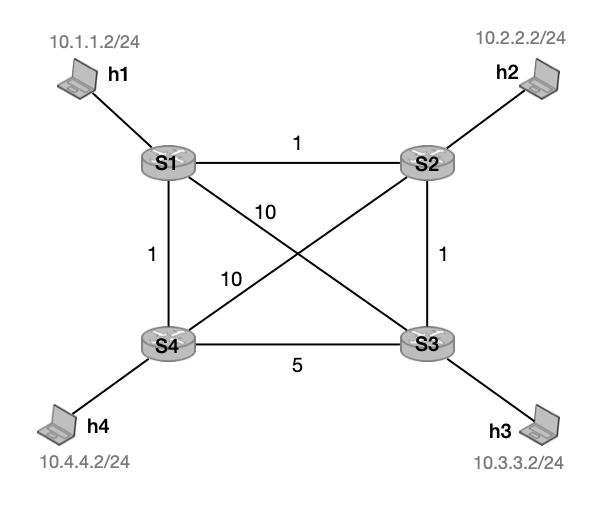
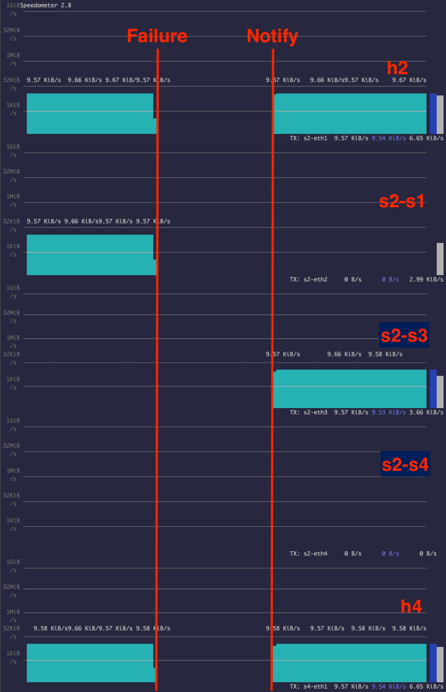
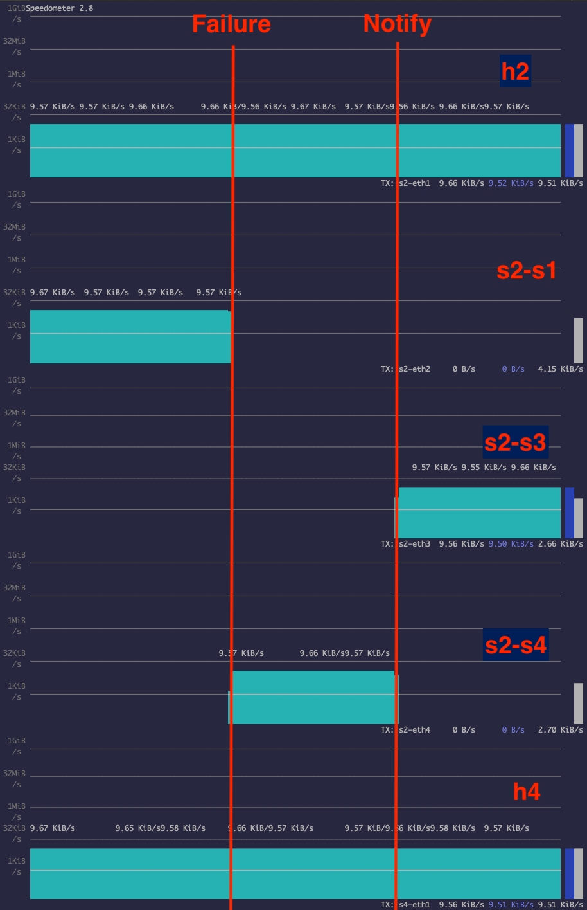

# IP Fast Reroute with Loop Free Alternate

在本练习中，我们将实现一种机制，以便在相邻链路发生故障时快速重新路由流量至无环路的备用 (LFA)。

首先，我们将介绍问题，然后概述基本设置和任务。

## Fast rerouting and LFAs

考虑以下拓扑，我们将在整个练习中使用它。



四个路由器相互之间连接，并且每个路由器连接一台主机。路由器之间的链路具有不同的权重，如图所示。我们假设有某种机制来确定最短路径并填充转发表。在本练习中，我们使用中央控制器，但这也可以通过 OSPF 等 IGP 协议来完成。

下图最左边可以看到到 h4 的转发路径，即目的前缀为 `10.4.4.2/24`。现在考虑 `S1` 和 `S2` 之间的链路发生故障。相邻路由器 `S1` 和 `S2` 将能够（几乎）立即检测到此故障，但网络恢复仍需要一些时间：需要向中央控制器通知故障，并重新计算最短路径；像 OSPF 这样的协议需要交换消息并收敛。在此期间，从 `S2` 和 `S3` 到 `10.4.4.2/24` 的所有流量都会丢失。在我们的小型的演示网络中，这是可以忽略不计的。然而，对于大型高速网络来说，从故障中恢复可能需要数百毫秒的时间，并且会丢失许多 GB 的流量。

*快速重新路由* 旨在缩小这一差距：除了通往目的地的下一跳之外，我们还可以安装（预先计算的）一个 *备份下一跳*。一旦路由器检测到本地链路故障，它可以立即通过备份去转发流量以确保连接，直到中央控制器/IGP协议有时间以最佳方式去更新所有转发路径。

然而，必须谨慎选择用于备份的下一跳。例如，请考虑 `S2` 使用 `S3` 作为通往 `S1`（它是下一个最短路径）的故障链路的备份，并开始将所有流量重新路由至 `10.4.4.2/24`。但是 `S3` 不知道链路故障，因此只是将流量**转发回** `S2`，从而导致路由环路，如下面中间的图所示。

为了防止此类环路，运营商可以使用具有无环路备用 (LFA) 的 IP 快速重新路由。 LFA 是 *不会导致循环* 的用于备份的下一跳。在我们的示例中，`S4` 是流向 `10.4.4.2/24` 的流量的 LFA。事实上，`S2` 可以开始将流量转发到 `S4`，并且它将到达目的地。

最终，当控制器/IGP协议更新所有路径以响应故障时，可以通过 `S3` 安全地发送流量。


需要为每个相邻链路和目的地计算每个路由器的 LFA。如上所述，LFA 不得将流量转发回源(src)。此条件可以用节点之间的距离来表示。令 `D(X, Y)` 为节点 `X` 和 `Y` 之间的距离。对于路由器 `S`，下一跳 `N` 是目的地 `D` 的 LFA，如果：

```
D(N, D) < D(N, S) + D(S, D)
```
请注意，此条件主要考虑单链路故障。在此练习中我们不会处理任何其他内容。有关节点故障、具有共同风险的链路等的更多考虑，请参阅 [IP 快速重新路由 RFC](https://tools.ietf.org/html/rfc5286)。

## Setup

我们为您提供了已经实现基本转发的基本设置以及引入故障的工具。具体来说，您将找到以下文件：

- `p4app.json` configures the topology introduced above with the help of mininet and the p4-utils package. Note that we disabled `pcap` logging to reduce disk usage. In case you want to use it, you will have to set the option to `true`.
- `network.py`: a Python scripts that initializes the topology using *Mininet* and *P4-Utils*. One can use indifferently `network.py` or `p4app.json` to start the network.
- `p4src/fast_reroute.p4`: the p4 program to use as a starting point. It already contains two register arrays: `primaryNH` allows looking up the port for a next hop, and `linkState` contains the local link information for a given port (you only need to read it): `0` if there are no issues, `1` if the link is down.
- `p4src/includes`: headers and parsers.
- `controller.py`: the central controller, already capable of installing forwarding rules and reacting to failures.
- `cli.py`: a CLI to introduce and reset link failures.
- `topology_generator.py`: a script to generate random topologies.

### Startup

首先，执行 `sudo p4run` (或 `sudo python network.py`)，这将启动 mininet 和所有的 p4 交换机。完成后，您将看到 mininet CLI。当 mininet 运行时，打开第二个终端或选项卡（这稍后会很有用），然后执行 `python controller.py`。这将首先启动 Python 控制器，它计算网络中的所有最短路径并安装相应的转发规则。之后，*重新路由 CLI* 将启动。

### Failing links

您可以使用 mininet CLI 引入流量，并使用重新路由 CLI 引入故障。

例如，在 mininet CLI 中运行 `h2 ping h1`。如果您的控制器已正确启动，您应该能够观察到 ping 响应。

当 ping 运行时，请切换到重新路由 CLI 并运行 `fail s1 s2`。顾名思义，这将使 `S1` 和 `S2` 之间的链路故障。

再看一下 mininet CLI。 ping 应该已经停止了。

CLI 将自动更新所有连接交换机的 `linkState` 寄存器以模拟本地的故障检测。然而，目前我们的交换机不利用此信息。

我们的控制器已经能够处理故障，但是为了模拟故障和控制器更新之间的延迟，控制器 *不会自动通知* 故障。在重新路由 CLI 中，运行 `notify`。这将调用 `controller.py` 中的 `failure_notification` 方法，它更新所有的转发表。通知控制器后，您应该观察到 ping 再次开始工作。

最后，您可以在重新路由 CLI 中运行 `reset`，然后运行 `notify`，以重置链路和转发状态。

### Note on IP addresses

在本练习中，我们使用 `l3` 这个 IP 分配策略，它将每个主机置于不同的网络中。分配给连接到交换机 `SY` 的主机 `hX` 的 IP 如下：`10.Y.X.2`。例如，在上面的拓扑中，`h1` 获取 `10.1.1.2/24`，`h2` 获取 `10.2.2.2/24`。
您可以在 `p4-utils` [文档](https://github.com/nsg-ethz/p4-utils#topology-description)中找到有关 `p4app.json` 的所有文档。


## Goals

该练习的目标是使交换机能够在相邻链路发生故障时快速将流量重新路由到 LFA。您将需要更新控制器和交换机才能实现此目的。

:information_source: 您 *不需要* 在控制器和交换机中实现故障检测或通知。这超出了本练习的范围，由 CLI 处理（[参见上文](#failing-links)）。

### Control-plane

即使某些链路发生故障，控制器也已经能够计算出最短路径。您需要按如下方式扩展它：

- 对于每个交换机和链路，您必须计算一个 LFA 下一跳，如果链路发生故障，交换机可以回退到该下一跳。
- 您需要在交换机中安装此 LFA。
- 当我们在固定拓扑下运行时，您的控制器也应该能够适用于其他拓扑。不要将 LFA 硬编码到您的代码中。

 :information_source: 并非所有拓扑都允许查找任何链路和目的地的 LFA。在实践中，网络通常被 *设计* 成使得这是可能的。

### Data-plane

交换机已经能够将流量转发到（主）下一跳，并包含每个端口处的链路状态的寄存器数组（由 CLI 更新）。您的目标是在链路发生故障时立即重新路由流量。为此，您需要扩展交换机的代码，如下所示：

- 与主要下一跳类似，将备用下一跳存储在交换机上。

- 读取主要下一跳的链路状态，如果主要下一跳已关闭，即 `linkState` 为 `1`，则选择备用下一跳，以便立即重新路由所有流量。

:information_source: 控制器需要在故障 *之前* 填充不同的主要和备份下一跳。


## Implementing IP Fast Reroute with LFA

在本节中，我们将为您提供一些实现指南。

### General

在本练习中，我们尝试尽可能简化您的工作，以便您可以专注于执行快速重新路由操作。

- 控制器知道所有主机的 MAC 地址，并且我们已经配置了所有的 MAC 地址更新。我们在此练习中不使用任何的 L2 学习。

- 您不必进行负载均衡。如果两条路径到达目的地的成本相同，则选择两条路径中的任意一条即可。

- 您的解决方案不需要能够处理多个链路故障。 LFA 只需要立刻防止单个链路发生故障即可。我们假设控制器在两次故障出现之间有足够的时间来更新主要下一跳和备份下一跳。当然，如果出现故障的链路太多，在某个时刻将不会留下任何 LFA，甚至控制器也无法修复此问题。

- 实践中，链路出现故障后网络会自动收敛。IGP协议会自动发出消息，或者自动通知控制器。在我们的网络中，这种情况不会发生，因此您可以更好地观察链路故障所带来的影响。相反，您可以手动 `notify` 控制器对故障链路做出反应（[参见上文](#failing-links)）。

### Control-plane

启动时，提供的控制器已经提供了完整的连接。它已配置每个目的地的下一跳索引（[更多信息见下文]（数据平面）），并填充了主要下一跳的寄存器数组。该下一跳索引允许交换机去查找相关的下一跳的端口。在本练习中，我们为每个主机分配一个唯一的下一跳索引，您不需要更改它。在实践中，会使用更有效的解决方案，例如对网络中采用相同路径的目的地进行分组。

您可以将全部注意力放在 `update_nexthops` 方法上。该方法用每个索引的实际下一跳去填充寄存器数组。例如，`h1` 的下一跳 ID 为`0`。如果没有故障，则交换机 `S2` 处通往 `h1` 的下一跳是位于端口 `2` 的 `S1`。因此，控制器将 `2` 写入 `S2` 上的 `primaryNH[0]`。如果 `S1` 和 `S2` 之间的链路出现故障，并 `notify` 控制器，它会用 `3` 来更新该寄存器，即指向 `S3` 的端口（以及其他交换机中的寄存器）。

您的任务是扩展此功能，不仅安装主要下一跳，还安装备份下一跳。您需要将其与您的 p4 代码进行协调，也就是说，您首先需要更新代码，以便控制器实际上可以将备份下一跳存储在某处。

当计算备份时，请记住备份下一跳取决于源路由器、主要下一跳和目的地。

:information_source: 主机本身也是一个下一跳，尽管您不需要在此处计算出一个备份下一跳，因为只有一个可用链路。

最后，您需要确保您不只是安装 *任何* 备份，而是安装 LFA。要检查 LFA 的状况，您可能需要节点之间的距离。`dijkstra` 方法将为您提供（最短）距离以及网络中每对节点的路径：

```python
failures = (given as input)
distances, paths = self.dijkstra(failures=failures)

distances['s1']['h3']  # Distance from s1 to h3.
paths['s1']['h3']      # Path from s1 to h3.
```

:information_source: 每次调用 `dijsktra` 时，都会重新计算最短路径，因此请确保不要频繁调用它，并且可以重新使用其输出。

### Data-plane

P4 提供的程序首先应用表 `ipv4_lpm`，该表使用最长前缀匹配（`lpm`）来匹配目标前缀。但是，该表不会立即映射到出口端口(egress port)，而是映射到一个下一跳的索引。这些索引在控制器启动时安装一次，而且无需再次修改。

使用此索引，交换机可以在 `primaryNH` 寄存器数组中查找相应的下一跳的出口端口。控制器最初将填充这些寄存器，并在发生故障后更新它们。

除了主要下一跳之外，您还需要实现一种查找备份下一跳（​​您的 LFA）的方法。实现另一个类似于 `primaryNH` 的寄存器数组可能会很有用，但其他解决方案也是可能的。

最后，您需要将所有内容放在一起，如果链路正常，则选择主要下一跳; 否则选择备份下一跳。您可以在 `linkState` 寄存器数组中找到此信息。端口 `X` 的链路状态存储在寄存器数组中的索引 `X` 处。如果链路正常，则为 `0`，如果链接故障，则为 `1`。请记住，您 *首先* 需要查找主要下一跳对应的端口，然后才能检查该端口处的链路是否已启动/正常运行。

## Testing your solution

下面，我们将为您提供一些调试程序的额外提示。

例如，我们将考虑 `S1` 和 `S2` 之间的链路故障，并将重点关注 `S2` 中发往 `10.4.4.2/24` 的流量的重新路由，与上面的介绍类似。

1.  启动拓扑.
    ```bash
    sudo p4run
    ```
    or

    ```bash
    sudo python network.py
    ```

2. 启动控制器.
    ```bash
    sudo python controller.py
    ```

3.  验证是否可以 ping 通:
    ```bash
    mininet> pingall
    ````

4.  我们来运行一下上图中的例子。我们将监视五个链路：`S1-h1`, `S4-h4` 以及 `S2` 的三个相邻链路。

    为了完全可视化这五个链路，我们可以打开单独的`tcpdump`，或者我们可以使用 `speedometer`。

    首先，您需要安装 `speedometer`：
    ```bash
    sudo apt-get install speedometer
    ```

    由于 `speedometer` 不兼容 Python3，我们必须强制使用 Python2 执行它。这可以通过运行以下命令来完成。
    ```bash
    sudo sed -i '1s+^.*$+#!/usr/bin/env python2+' $(which speedometer)
    ```

    然后您可以运行如下命令:
    ```bash
    speedometer -t s2-eth1 -t s2-eth2 -t s2-eth3 -t s2-eth4 -t s4-eth1
    ```

    :information_source: 要查看所有交换机的接口名称，您可以在 mininet CLI 中输入 `net`：
    ```
    mininet> net
    h1 h1-eth0:s1-eth1
    h2 h2-eth0:s2-eth1
    h3 h3-eth0:s3-eth1
    h4 h4-eth0:s4-eth1
    s1 lo:  s1-eth1:h1-eth0 s1-eth2:s2-eth2 s1-eth3:s4-eth3 s1-eth4:s3-eth4
    s2 lo:  s2-eth1:h2-eth0 s2-eth2:s1-eth2 s2-eth3:s3-eth2 s2-eth4:s4-eth4
    s3 lo:  s3-eth1:h3-eth0 s3-eth2:s2-eth3 s3-eth3:s4-eth2 s3-eth4:s1-eth4
    s4 lo:  s4-eth1:h4-eth0 s4-eth2:s3-eth3 s4-eth3:s1-eth3 s4-eth4:s2-eth4
    ```

5.  以较短的间隔从 h1 ping h4 以查看更多流量
    ```
    mininet> h2 ping h4 -i 0.01
    ```

6.  主动使 S1-S2 链路出现故障, 您可以通过控制器 CLI 来实现:
    ```
    link-menu> fail s1 s2
    ```

7.  最后，通知控制器有关故障的信息，以便其重新计算新的路径并更新交换机中的主要路由。您可以从控制器 CLI 执行此操作。
    ```
    link-menu> notify
    ```

8. 使用默认的 p4 代码和控制器代码，在发生故障和您通知控制器并更新交换机之间的流量将会丢失。请参阅以下屏幕截图。



如您所见，在故障和通知之间，流量出现了丢失。当您更新 p4 代码和控制器以将流量快速重新路由到 LFA 时，您应该看到以下输出。



在这里，您可以看到 `S2` 快速将流量重新路由到 `S4`，即 LFA。控制器重新计算出最短路径后，`S2` 将流量转发到新的主要下一跳 `S3`。

## Testing with another topology

完成本练习后，您应该拥有一个能够填充任何拓扑的路由表和寄存器的控制器。要测试您的解决方案是否适用于其他拓扑，您可以使用`topology_generator.py` 来生成一个随机拓扑：

```bash
python topology_generator.py --output_name <name.json> --topo random -n <number of switches to use> -d <average switch degree>
```

这将创建一个具有 `n` 个交换机的随机拓扑，这些交换机平均具有 `d` 个接口（取决于 `n`，`d` 也许不可能）。此外，每个交换机都会有一个直接连接到它的主机（因此总共有 `n` 个主机）。例如，您可以创建一个具有 `10` 个交换机且平均度数为 `4` 的随机拓扑：

```bash
python topology_generator.py --output_name 10-switches.json --topo random -n 10 -d 4
```

运行这个随机拓扑:

```bash
sudo p4run --config 10-switches.json
```

如果您想使用 Python 脚本而不是 JSON 文件，您可能需要运行：

```bash
python network_generator.py --output_name 10-switches.py --topo random -n 10 -d 4
```

and
```bash
sudo python 10-switches.py
```

现在运行控制器，并检查是否可以使用 `pingall` 将流量发送到所有节点。

```
mininet> pingall
*** Ping: testing ping reachability
h1 -> h2 h3 h4 h5 h6 h7 h8 h9 h10
h2 -> h1 h3 h4 h5 h6 h7 h8 h9 h10
h3 -> h1 h2 h4 h5 h6 h7 h8 h9 h10
h4 -> h1 h2 h3 h5 h6 h7 h8 h9 h10
h5 -> h1 h2 h3 h4 h6 h7 h8 h9 h10
h6 -> h1 h2 h3 h4 h5 h7 h8 h9 h10
h7 -> h1 h2 h3 h4 h5 h6 h8 h9 h10
h8 -> h1 h2 h3 h4 h5 h6 h7 h9 h10
h9 -> h1 h2 h3 h4 h5 h6 h7 h8 h10
h10 -> h1 h2 h3 h4 h5 h6 h7 h8 h9
*** Results: 0% dropped (90/90 received)
```

然后使某个链路故障，例如 `s2` 和 `s9` 之间的链路（在 mininet CLI 中编写 `links` 时可以看到所有链路）。

最后，当您运行默认的 p4 和 python 代码时，您应该会看到数据包丢失。

```
mininet> pingall
*** Ping: testing ping reachability
h1 -> h2 h3 h4 h5 h6 h7 h8 h9 h10
h2 -> h1 h3 h4 X h6 h7 h8 X h10
h3 -> h1 h2 h4 h5 h6 h7 h8 h9 h10
h4 -> h1 h2 h3 h5 h6 h7 h8 h9 h10
h5 -> h1 X h3 h4 h6 h7 h8 h9 h10
h6 -> h1 h2 h3 h4 h5 h7 h8 h9 h10
h7 -> h1 h2 h3 h4 h5 h6 h8 h9 h10
h8 -> h1 h2 h3 h4 h5 h6 h7 h9 h10
h9 -> h1 X h3 h4 h5 h6 h7 h8 h10
h10 -> h1 h2 h3 h4 h5 h6 h7 h8 h9
*** Results: 4% dropped (86/90 received)
```

但是，通过实现到 LFA 的 IP 快速重新路由，您不应该看到数据包的丢失。

:information_source: 请记住，在随机拓扑中，可能无法找到某些链路的 LFA。如果您的解决方案不起作用，请首先检查是否可以为那些故障链路找到 LFA。
