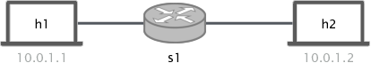

# Count-Min Sketch

## Introduction

<p align="center">

<p/>

在今天的练习中，我们将实现一个新的概率数据结构 —— Count-min Sketch。正如您在讲座中所看到的，Count-min Sketch 是一种概率算法，可用于估计不同元素的出现次数（类似于我们在上周讲座
和之前的练习中看到的计数布隆过滤器）。

为了实现 Count-min Sketch，我们将使用 `registers` 和 `hash` 函数。但这一次，我们必须定义多个寄存器，并为每个寄存器使用不同的哈希函数。要使用Count-min Sketch 来对属于某个流的数据包进行计数，我们必须使用 N 个不同的哈希函数对每个数据包的五元组（src、dst、sport、dport、proto）进行哈希处理。每个哈希输出用作不同的寄存器中的索引并将相应位置的值加 1（如下图所示）。为了读取给定流的被计数了多少次，我们必须对五元组进行哈希处理，读取每个寄存器的值并选择它们中的最小值。

<p align="center">

<p/>

在本练习中，我们将使用 P4 实现一个 Count-min Sketch，控制器将从交换机中读取计数器并对其进行解析，最后还将对 sketch 的尺寸进行调整。


### Disabling debugging in the bmv2 switch

为了测试我们的 sketch 的性能，我们需要向交换机发送数十万个数据包。正如您在前面的练习中已经
看到的，如果您在直接连接的主机之间执行 `iperf` ，您将获得大约 `15~20mbps` 的带宽。为了能够更快速地将数据包发送到交换机，我们可以使用不同的名称再次克隆此repository，并使用不同的标志对其进行编译。由于此过程最多可能需要 10 分钟，因此您可以让它在后台运行。

```bash
cd ~/p4-tools/
git clone https://github.com/p4lang/behavioral-model.git bmv2-opt
cd bmv2-opt
git checkout 62a013a15ed2c42b1063c26331d73c2560d1e4d0
./autogen.sh
./configure --without-nanomsg --disable-elogger --disable-logging-macros 'CFLAGS=-g -O2' 'CXXFLAGS=-g -O2'
make -j 2
sudo make install
sudo ldconfig
```

**IMPORTANT:** 建议您在找到可行的解决方案之前不要运行 `sudo make install` 命令。
当使用这种优化编译时，交换机不会生成日志文件，因此您将很难正确调试程序。

因为我们在不同的文件夹中保留了两个`bmv2`的编译版本，因此您只需再次运行 `make install` 命令即可启用那个启用了 `debugging` 的版本:

```bash
cd ~/p4-tools/bmv2
sudo make install
sudo ldconfig
```

因此，通过在 `~/p4-tools/bmv2` 或 `~/p4-tools/bmv2-opt`中运行 `sudo make install`，您可以轻松启用每个编译版本。

### What is already provided

For this exercise we provide you with the following files:

- `p4app.json`: 描述了我们想要在 mininet 和 p4-utils package 的帮助下创建的拓扑.
- `network.py`: 使用 *Mininet* 和 *P4-Utils* 来初始化拓扑的 Python 脚本。人们
可以随意使用 `network.py` 或 `p4app.json` 来启动网络。
- `p4src/cm-sketch.p4`: 用作开始点的 p4 程序骨架。此外，我们还为您提供了 `headers.p4` 和 `parsers.p4` 文件，这样您就不必再次编写它。
- `send.py`: 使用原始套接字(raw socket)发送数据包的 python 程序（`scapy`对于我们在本练习中所需的速度来说还不够快）。
- `cm-sketch-controller.py`: 使用 `thrift_API` 与交换机进行通信的控制器。您会发现一些实用函数将有助于草图解码。在这里您还必须实现部分算法。
- `crc.py` 控制器将使用由 python 编写的 `crc32` 实现来读取计数器。

#### Notes about p4app.json

对于本练习，我们将使用 `mixed` 策略，但这并不是很重要，因为我们将仅使用交换机通过它发送数据包并运行 Count-min Sketch。在这个小型拓扑中，`h1` 和 `h2` 连接到同一个交换机 `s1`，IP 分配分别为`10.0.1.1` 和 `10.0.1.2`。

您可以在 `p4-utils`[文档](https://nsg-ethz.github.io/p4-utils/usage.html#json)中找到有关 `p4app.json` 的所有文档。此外，您还可以在[此处](https://nsg-ethz.github.io/p4-utils/usage.html#automated-assignment-strategies)找到有关分配策略的信息。

## Implementing the count-min sketch and the decoding controller

为了解决这个练习，我们必须做两件事：i）在 P4 中实现 count-min sketch，ii）使用控制器解码读取到的值并将它们与真实/实际值进行比较。

#### Count-min Sketch

The program running in the switch needs to be able to do two things:

   * Forward packets from port 1 to 2 and vice-versa.
   * Execute the Sketch for every `tcp` packet observed.

To successfully complete the p4 program you have to:

1. Define a forwarding table that forwards packets from port 1 to port 2 and vice-versa. This is exactly what we did in the `repeater` exercise, thus you can copy your solution from there. The table should match the `ingress_port` and in case of match call a `set_egress_port` action.

2. Define the `set_egress_port` action. The action gets an `bit<9> egress_port` number and sets it as `egress_spec`.

3. Define the `s1-commands.txt` file to fill the table. You just need two entries.

4. Define `N` registers. To set the width of each register cell use the constant `SKETCH_CELL_BIT_WIDTH`.To set the register size use the `SKETCH_BUCKET_LENGTH` constant (which you have to define depending on your needs). In order to easily read the registers from the controller, you should name them as follows: `sketch<num>` for example: `sketch0`, `sketch1`,.., `sketchN`.

5. Define the `sketch_count` action. In this action you should do the following for each register:

   1. Define N metadata field of width 32 in which to store the output of each hash computation.
   2. Define N metadata fields of width `SKETCH_CELL_BIT_WIDTH` to store the counter read from each register.
   3. Hash the packets 5-tuple in this order: srcAddr, dstAddr, srcPort, dstPort, protocol. Send the output to the metadata field you just
   defined. As a max (or module) value for the hash use the constant `SKETCH_BUCKET_LENGTH`. **Important:** use the `HashAlgorithm.crc32_custom`: since we want to potentially define N hash functions and only few algorithms are available, we will use the `crc32_custom` algorithm that the simple switch provides.
   The polynomial of this algorithm can be modified at runtime by the controller, in our case (this is provided) the controller will automatically configure all the hash functions with different polynomials such that they return different hash outputs.
   You can read more about the `crc32` configuration [here](https://www.cosc.canterbury.ac.nz/greg.ewing/essays/CRC-Reverse-Engineering.html).
   4. For each hash output value (index to register) read the count value of its respective register and save it into the variables defined in 2. Add one to the variable and write that to the register. Make sure that you use the output of your `hash0` with `sketch0`.

6. Define the ingress block logic. Apply the `forwarding` table. Furthermore, if the packet is `ipv4` and `tcp` apply the `sketch_count` action.

#### Controller

In order to read the count-min sketch counter you will have to implement a small algorithm at the controller. We provide you with a partial controller
implementation that already does several things for you. Amongst others, the controller does:

1. Configures the `crc32_custom` hash algorithms that you defined in the switch (at the moment it can do up to 16 hashes). This is done by the function `set_crc_custom_hashes`.
This function uses the `runtimeAPI` (which uses the `thrift` API) to set the polynomials of each `crc`. You can see the list of polynomials at the beginning of the file.

2. It will create some `crc32` hash objects and append them to `self.hashes`. Note that this hashes (implemented in python) are the same than the ones you will be running in the switch. Thus `self.hashes[0]` == the first hash you defined in your P4 program. To get the output of the hash you have to call the method `bit_by_bit_fast(5-tuple)`.

To successfully implement the controller you have to:

1. Define a function to read the N registers and save them in order in `self.registers` list. To read a register use the controller API: `self.controller.register_read(<name>)`, this will return a list with all the register fields. The amount of registers available in the switch  (which should be the same than hashes) can be found in `self.register_num`. Remember that if you named your registers with the following pattern `sketch<num>` you can easily read them with a simple iteration.

2. Define a function to get the count of a given flow. As an input the function needs the flow's 5-tuple and the length of the registers (to use it to modulo the output of the hash). To successfully
implement this function you should hash the flow 5-tuple with all the different hash functions `self.hashes[i]` (remember to apply the modulo to the output to get the right index). For each hash `i` read the
`self.registers[i][hash_output[i]]` and return the minimum of them. The hash function takes a bytestream as input, to generate the bytestream out of the 5-tuple use the function `flow_to_stream(flow)`, the input parameter has to be a list or tuple of the form ("10.0.1.1", "10.0.1.2", 5000, 7000). Note that the protocol is not needed and will be automatically added.

3. Define the main (call it `decode_registers`) function to decode all the registers and compare them with the ground truth. This function has as input: epsilon, number of packets used in the experiment, registers length, and a file with the flows sent during the experiment (to know more about this check out the testing the solution section). In more details
you have to:

   1. Read the registers (call the function you defined in 1).
   2. Load the `sent_flows.pickle` file. This file contains a python dictionary with the ground truth. The dictionary is of the form `{(flow): packet_count}`. To load a pickle file you need to use: `pickle.load(open(file_name, "r"))`
   3. For each flow read the count value out of the registers using the function defined in 2.
   4. For each flow you can check if you are inside the bound: counter <= (`real_counter` + ϵ*η).
   5. You can also determine if 4 holds with probability 1 - δ.
   6. You are free to compute any statistics out of your computations, such as total error, relative errors to single flows, etc.

**Note:** that all the variables needed to solve the above items can be passed through command line parameters. See the `cm-sketch-controller.py` file at the bottom.

#### Dimensioning

在今天的课程中，你已经学习到一个count-min sketch会遵循如下性质:

   1. 估计的计数值与实际数量相比，会相同或者更大。
   2. 在概率为 1 - δ 时，误差不会大于 `real_count` + ϵ*η 。其中 ϵ 为误差因子，η 为哈希数据包的数量，δ 为误差概率。

经过一番分析，我们可以得到一些用于确定数组维数和个数的公式:

 * `Number of registers:` ceil(ln(1/δ))
 * `Register length:` ceil(e/ϵ)

举个例子，如果我们想要 ϵ=0.1 和 δ=0.05，那么寄存器的个数应为3，每个寄存器的大小应为28。

## 测试解决方案

为了测试所写的解决方案，我们将使用 `send.py` 脚本，您可以在提供的文件中找到此脚本。这个脚本使用原始套接字(raw sockets)来生成随机流。数据包的数量、流的大小、流的分布都可以通过调整命令行参数来进行配置:

```python
parser.add_argument('--n-pkt', help='数据包的数量', type=int, required=False, default=5000)
parser.add_argument('--n-hh', help='重击流的数量', type=int, required=False, default=10)
parser.add_argument('--n-sfw', help='小流的数量', type=int, required=False, default=990)
parser.add_argument('--p-hh', help='重击流发送的数据包所占的百分比',type=float, required=False, default=0.95)
```

除了发送随机流之外，脚本还将在文件中保存带有 `{(flows): packets_sent}` 的字典。
控制器可以将该字典用作真实的有效值，以此来比较实际发送的数据包数量和 count-min sketch
所计数的数量。

您可能还将使用我们为您提供的、同样您必须修改和增强的控制器。可以使用以下参数去调用控制器:

```python
parser.add_argument('--sw', help="需要进行配置的交换机名称" , type=str, required=False, default="s1")
parser.add_argument('--eps', help="检查边界时使用的epsilon", type=float, required=False, default=0.01)
parser.add_argument('--n', help="由send.py应用发送的数据包数量", type=int, required=False, default=1000)
parser.add_argument('--mod', help="每个寄存器的大小", type=int, required=False, default=4096)
parser.add_argument('--flow-file', help="由send.py生成的文件的文件名", type=str, required=False, default="sent_flows.pickle")
parser.add_argument('--option', help="控制器选项可以是set_hashes、decode或重置寄存器", type=str, required=False, default="set_hashes")
```

#### 测试行为正确性

使用 ϵ=0.1 和 δ=0.05 来标注 sketch 的尺寸（如上所示）。然后启动拓扑，使用控制器去配置哈希函数，并使用 send.py 从 `h1` 发送流量以发送少量的流（仅用于测试）。

1. 使用 `sudo p4run` 或 `sudo python network.py` 来启动拓扑。

2. 通过运行选项参数为 `set_hashes` 的默认控制器来设置哈希函数的多项式。这将为正在运行的交换机设置正确的多项式，因此当我们解码时，我们将使用相同的精确哈希值。

```bash
python cm-sketch-controller.py --option "set_hashes"
```

3. 打开一个 `h1` 的终端，然后发送一部分流量（仅有 2 个重击流）去测试您的解码器是否工作。

```bash
xterm h1
python send.py --n-pkt 1000 --n-hh 2 --n-sfw 0 --p-hh 1
```

这个脚本将创建两个大小近似为 500 个数据包的流，它还将在 `sent_flows.pickle` 中保存一个字典，其中包含每个流发送的数据包的确切数量，即 `{(flows): packets_sent}`。控制器的解码函数应当读取上面这个文件，并尝试提取/读取这些流的计数器，然后检查计数值是否在允许的范围之内。

4. 最后，在启用 `decode` 选项和正确的解码参数的情况下运行控制器。

```bash
python cm-sketch-controller.py --eps 0.1 --n 1000 --mod 28 --option decode
```


#### Playing with dimensions

在开始更多测试之前，请确保安装 `bmv2` 的优化版本。此外，打开 `send.py` 文件，转到 `send_n` 函数，并将 `time.sleep(0.001)` 替换为 `time.sleep(0.0002)`。通过优化版本，我们发送数据包的速度可以提高 5 倍。

现在我们将混合大流和小流，而不​​是只发送 2 个流。使用以下参数运行 `send.py`:

```bash
mx h1
python send.py --n-pkt 100000 --n-hh 10 --n-sfw 990 --p-hh 0.95
```

您应该看到大流具有良好的大小估计，但是小流都与实际值相距甚远。这是由于寄存器的大小（28 个单元）造成的。小流发送 0 到 10 个数据包，但每个单元的预期值约为 150。

如果将单元大小增加到更大，例如 4096，并重复测试（请确保重新启动交换机和控制器）。您将看到估计出的计数值和实际值将非常接近（但是不完全相同）。

此时，您应该能够根据您的流量组合以及您想要实现的目标来推理如何确定 Count-min Sketch 的尺寸。修改寄存器的数量和大小并尝试不同的流量分布，以检查您在讲座中学到的理论是否成立。

#### Some notes on debugging and troubleshooting

我们在文档部分添加了一个[小指南](https://github.com/nsg-ethz/p4-learning/wiki/Debugging-and-Troubleshooting)。当事情没有按预期进行时，可以将其用作参考。
