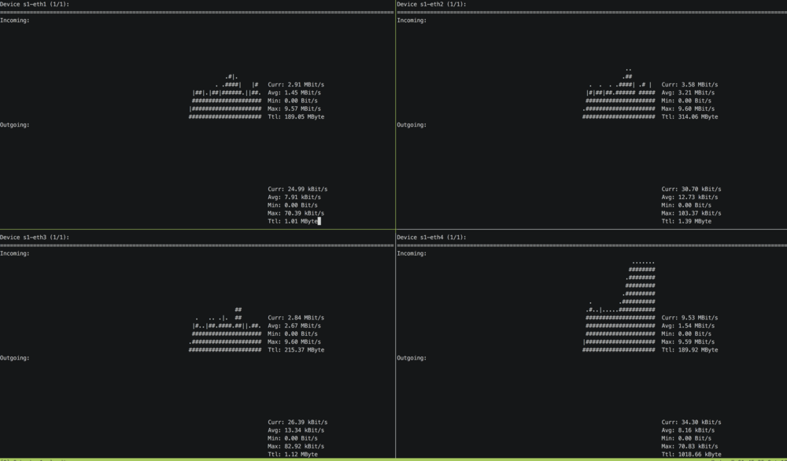

# Congestion Aware Load Balancing

## Introduction

在之前的练习中，您已经实现了ECMP，它（在理想情况下）将流量均匀地分配到多条并行路径上。然而，ECMP 并没有考虑到流量大小差异很大的情况（通常会有几个非常大的流量和许多小流量）。即使将流量均匀地分布在多条路径上，但如果出现许多大流量集中在同一条路径上，也会导致一些问题。解决这个可能导致拥塞的问题是本练习的目标。

我们将利用 P4 交换机允许读取队列信息（例如，有多少数据包正在等待传输）这一事实，并利用这一信息来检测拥塞情况（即队列中是否包含很多数据包）。在这种情况下，发生拥塞的流量应被转移到另一条路径上。我们将尝试使用一种非常简单的技术来避免拥塞：每次出口（目的主机前一跳的那个交换机）检测到数据包拥塞时，它都会它会向入口交换机发送一条通知信息，入口交换机收到该信息后会随机将数据流转移到另一条路径上。显然，这不是探索可用路径的最佳方法，但这足以说明如何在数据包穿越网络时收集信息、在交换机之间进行通信并使它们对网络状态做出反应。

作为本练习的起点，我们使用上周 simple_router 中的代码（您可以使用我们在骨架中提供的解决方案，也可以使用您自己的代码，如果您想要设法解决它）。在本练习中，我们可能会使用多个拓扑结构，因此使用上一个练习中的 `routing-controller.py` 会非常方便。

## Before starting

在您开始这个练习之前, 请更新 `p4-utils`, 上周修复了一些新功能和错误:

```bash
cd ~/p4-tools/p4-utils
git pull
```

您必须安装我们将在练习中使用的两个新工具：

1. `nload`: 一个控制台应用程序，可实时监控网络流量和带宽使用情况。

   ```bash
   sudo apt-get install nload
   ```

2. `iperf3`: 一个较新版本的 `iperf` ，并提供了新选项:

   ```bash
   cd /tmp
   sudo apt-get remove iperf3 libiperf0
   wget https://iperf.fr/download/ubuntu/libiperf0_3.1.3-1_amd64.deb
   wget https://iperf.fr/download/ubuntu/iperf3_3.1.3-1_amd64.deb
   sudo dpkg -i libiperf0_3.1.3-1_amd64.deb iperf3_3.1.3-1_amd64.deb
   rm libiperf0_3.1.3-1_amd64.deb iperf3_3.1.3-1_amd64.deb
   ```

### What is already provided

对于本练习，我们为您提供以下文件：

- `p4app-line.json`: 描述了我们希望借助 mininet 和 p4-utils 软件包创建的拓扑结构。这个线性拓扑将用于我们的首次测试。
- `network.py`: 是一个 Python 脚本，使用 *Mininet* 和 *P4-Utils* 对拓扑结构进行初始化。可以使用 `network.py` 或 `p4app.json` 来启动网络。
- `p4app.json`: 描述了我们在 `ecmp` 练习中使用的拓扑结构，即 2 个交换机通过 4 个中间交换机连接。
- `p4src/loadbalancer.p4`: 我们将使用 [05-Simple_Routing](../05-Simple_Routing) 这个练习中的解决方案作为起点。
- `send.py`: 生成 tcp 探测包以读取队列的一个小型 python 脚本。
- `receive.py`: 一个小型 python 脚本，用于接收包含 `telemetry` 报头的 tcp 探测。
- `routing-controller.py`:  [05-Simple_Routing](../05-Simple_Routing) 练习中的路由控制器作为起点。
- `nload_tmux_*.sh`: 这些脚本将创建一个 tmux 窗口，并在不同的窗格运行 `nload`。
- `send_traffic_*.py`: 使用 `iperf3` 自动生成流的 python 脚本，以测试我们的解决方案。

#### New configuration fields in p4app.json

在本练习中，您会发现两个新的配置字段： `exec_scripts` 和 `default_bw`（在拓扑描述中）。

1. `exec_scripts`: 它允许您去添加能够在拓扑启动后自动调用的脚本。这些脚本将在 `root` 命名空间中调用，而不是在任何主机内调用。例如，在提供的拓扑中，每次启动（或重新启动）拓扑时，我们都会使用此字段来调用 `routing-controller.py`。因此，您不必手动运行控制器。如果出于调试原因您想自己启动控制器，只需删除此选项（将 `reboot_run` 设置为 false 是不够的）。

2. `default_bw`: 你可以看到我们在 `topology` 描述中使用了这个选项。这可用于设置拓扑中**所有链路**的带宽。在本练习中，我们将它们设置为 `10mbps`。

#### Notes about p4app.json

对于本练习，我们将使用 `l3` 分配策略。`mixed` 分配策略为：连接到同一个交换机的主机形成一个子网，每个交换机形成一个不同的域。与 `mixed` 策略不同的是，在 `l3` 分配中，我们认为交换机仅在第 3 层工作，这意味着每个接口必须属于不同的子网。如果您使用`hY` 和 `sX` 进行命名（例如 h1、h2、s1、s2...），IP 分配将如下所示：

   1. 主机 IP: `10.x.y.2`, 这里 `x` 是网关交换机的 ID, 而 `y` 则是主机的 ID.
   2. 直接连接主机的交换机端口：`10.x.y.1`，这里 `x` 是网关交换机的 ID, 而 `y` 则是主机的 ID。
   3. 交换机到交换机的端口：`20.sw1.sw2.<1,2>`。其中 `sw1` 是第一个交换机的 id（遵循 `p4app` 中链路定义的顺序）， `sw2` 是第二个交换机的 id。最后一个字节对于 sw1 的接口为 1，对于 sw2 的接口为 2。

请注意，这是我们第二次为交换机分配 IP 地址。然而，值得注意的是，实际上 `p4-utils` 不会将这些 IP 分配给交换机，但它会保存它们，以便它们可以 `virtually` 用于某些交换机功能（我们稍后会看到这意味着什么）。

您可以在 `p4-utils` [文档](https://github.com/nsg-ethz/p4-utils#topology-description)中找到有关 `p4app.json` 的所有文档。

#### Understanding the router's P4 program

本练习的数据平面程序与上周的 [05-Simple_Routing](../05-Simple_Routing) 练习的解决方案相同（但是，如果您愿意，您可以自由使用自己的解决方案，而不是我们为您提供的解决方案）以下描述将基于我们提供的 ECMP 解决方案）。

在继续之前，花点时间再次浏览一下 P4 代码，提醒自己该程序是如何工作的。

在本练习中，我们将给出较少的提示（与之前的练习相比），您将能够自行决定如何实现算法的某些部分。为了弥补这一点，你将有两周的时间来完成这个练习。

#### Observing the problem

在开始练习之前，让我们使用当前代码并观察流如何碰撞。

1. 启动中型大小的拓扑，其中有 4 台主机连接到另外 4 台主机，中间有 4 条路径：

   ```bash
   sudo p4run --config p4app-medium.json
   ```

   or
   ```bash
   sudo python network_medium.py
   ```

2. 打开一个 `tmux` 终端（或者如果您已经使用 `tmux` ，请打开另一个窗口）。并运行监控脚本（`nload_tmux_medium.sh`）。该脚本将使用 `tmux` 创建一个具有 4 个窗格的窗口，在每个窗格中它将启动一个 `nload` 会话来监视不同的接口（从 `s1-eth1` 到 `s1-eth4`），而且这些接口是分别直接连接到 `h1-h4`。

   ```bash
   ./nload_tmux_medium.sh
   ```

3. 将流量从 `h1-h4` 发送到 `h5-h8`。有一个脚本会自动为您执行此操作。它将从每个主机运行 1 个流：

   ```bash
   python send_traffic.py <time_to_send>
   ```

4. 如果你想发送 4 个不同的流，你可以再次运行该命令，它会首先停止所有 `iperf3` 会话，或者，如果你想停止流生成，你可以杀死它们：

   ```bash
   sudo killall iperf3
   ```

如果每个流被放置到不同的路径（极不可能），您应该获得接近 `9.5mbps` 的带宽（请记住，我们将链路的带宽设置为该值）。例如，尝试一次后，我们发现有 3 个流在同一路径中发生冲突，因此它们获得约 3mpbs 的带宽，而另一个流获得完整的带宽：

<p align="center">

<p/>

此练习的目的是为网络提供检测此类冲突并做出反应的方法。

#### Detecting Congestion

在实现真正的解决方案之前，我们首先对起始 p4 程序进行一些小修改，以展示如何读取队列信息。我们将在本节中实现的一些代码必须针对最终解决方案进行更改。我们在此示例中的目标是，如果数据包没有 `telemetry` 报头（在第一个交换机），则添加 `telemetry` 报头，然后更新其 `enq_qdepth` 值，将其设置为我们沿路径找到的最高值。

1. 首先向程序添加一个新报头并将其命名为 `telemetry`。该报头将有两个字段：`enq_qdepth`（16 位）和 `nextHeaderType`（也是 16 位）。添加后，此报头需要放置在 `ethernet` 和 `ipv4` 之间（在定义解析器时考虑到这一点）。
2. 相应对逆解析器进行更新。
3. 当数据包携带 `telemetry` 报头时, `ethernet.etherType` 的值需要被设置为 `0x7777`. 并相应地更新解析器. 请注意，`telemetry` 报头有一个 `nextHeaderType`，解析器可以使用它来知道哪个将是它后面一个地报头。通常为`ipv4` (0x800)。

4. 当数据包被流量管理器排队到其输出端口时，所有排队信息都会被填充。因此，排队信息仅在出口管道(egress pipeline)处可用。为了使这个简单的测试工作，您必须在出口管道上实现以下逻辑：
    1. 如果 `tcp` 报头生效, 则 `tcp.dstPort == 7777` (这是我们用于发送探针的技巧, see [scapy sending script](./send.py)).
    2. 如果没有 `telemetry` 报头则添加它，并将队列深度字段设置为 `standard_metadata.enq_qdepth`（这是该数据包在入队时队列中数据包的数量，您可以在[v1model.p4]中看到所有队列元数据字段(https://github.com/p4lang/p4c/blob/master/p4include/v1model.p4#L59).将以太网类型修改为上面提到的类型，将 `nextHeaderType` 设置为 ipv4 以太网类型。
    3. 如果已经存在 `telemetry` 报头，则仅当深度字段比已有值更高时才将深度字段设置为 `standard_metadata.enq_qdepth`。

此时，您的交换机应将 `telemetry` 报头添加到目标端口为 7777 的所有 tcp 数据包中。此 `telemetry` 报头将携带在路径中找到的最差队列深度(也就是最大的队列深度)。要测试您的拥塞读取器是否工作，请执行以下操作：

1. 启动线性拓扑，它有 3 个串联的交换机，每个端点连接2个主机。

   ```bash
   sudo p4run --config p4app-line.json
   ```

   or
   ```bash
   sudo python network_line.py
   ```

2. 在 `h1` 和 `h3` 中打开终端。并运行 send.py 和 receive.py 脚本。
 
   ```bash
   mx h3
   python receive.py
   ```

   ```bash
   mx h1 python send.py 10.3.3.2 1000
   ```

  您现在应该看到 receiver 打印了我们发送的探测器观察到的队列深度（dst 端口 == 7777 的数据包）。当然，由于我们不发送任何流量，队列始终为 0。

3. 从根命名空间运行 `send_traffic_simple.py`，您不必登录 `h1`。该脚本将生成从 `h1` 和 `h2` 到 `h3` 和 `h4` 的两个流。这两个流将会发生冲突（因为只有一条路径）。如果继续发送探测，您应该会看到队列如何填充到 63 并开始振荡（由于 TCP 性质）。


#### Important note

在这个介绍性的任务中，您必须仅向探测数据包添加额外的报头（4 个字节）。在下一个任务中，您将对每个数据包执行此操作。我们应该意识到这会给您带来后果。如果主机发送大小为 9500（拓扑中链路的 MTU）的数据包。

#### Keeping the telemetry in-network

在上一节中，我们在数据包通过特定目的端口进入网络时设置 `telemetry` 报头，并保留该 `telemetry` 报头直到其到达目的地。我们这样做只是为了向您展示当我们使流在一条路径中发生冲突时队列深度如何变化。

在我们的实际实现中，只有网络内部的交换机才会使用 `telemetry` 报头来检测拥塞并移动那些流。因此，离开内部网络（前往主机）的数据包中不应包含此 `telemetry` 报头。因此，我们需要在数据包到达目的主机之前将其删除。

为此，您需要知道哪种类型的节点（主机或交换机）连接到每个交换机的端口。正如我们在其他练习中所看到的，要做类似的事情，我们需要使用表、控制平面以及知道节点如何连接的拓扑对象。简而言之，在本节中您必须：

1. 在入口管道中定义一个新的表和动作，用于了解数据包将前往哪个出口端口。该表应与 `egress_spec` 相匹配。并调用一个动作来设置数据包将前往哪种类型的节点（将其保存在一个元数据字段中）。例如，您可以使用数字 1 表示主机，使用数字 2 表示交换机。

2. 修改 `routing-controller.py` 程序，使其填充此表。您可以通过在 `set_egress_type_table` 函数中写入来做到这一点。对于每个交换机，您应该使用一个端口来填充此表，并将节点类型连接到（主机（1）或交换机（2））。

3. 当 `egress_spec` 已知后，在入口控制处应用此表。

4. 修改之前实现的出口代码：
    1. 对 tcp 端口为 7777 不再检查（删除那部分代码，以便最终真正实现）。

    2. 如果 `telemetry` 报头有效且下一跳是交换机：如果元数据的 `enq_qdepth` 字段大于当前字段，则更新该字段。

    3. 如果 `telemetry` 报头有效，但下一跳是主机：删除 `telemetry` 报头，并将 `etherType` 设置为 `ipv4`。

    4. 如果没有 `telemetry` 报头且下一跳是交换机：添加 `telemetry` 报头，并设置 depth 字段、nextHeaderType 并将以太网类型设置为 0x7777。

此时，对于进入网络的每个 tcp 数据包，交换机应添加 `telemetry` 报头并在到主机前一跳的交换机时将其删除。要测试它是否有效，您可以发送 tcp 流量并使用 wireshark（监视网络的内部链路）检查以太网报头确实是 `0x7777`，并且接下来的 4 个字节属于 `telemetry` 报头，并且该流量退出网络（去主机那里）看起来很正常。

**重要** 由于向数据包添加了额外的字节，您将无法再直接从 minninet 的命令行界面运行 `mininet> iperf` 命令。如果您没有使用选项 (`-M`) 指定它，iperf 发送的数据包将使用发送者输出接口的最大 MTU 大小。因此，如果主机发送具有最大 MTU 的数据包，然后第一个交换机添加 4 个字节，它们将被接口丢弃。在我们使用 `P4-utils` 创建的网络中，mtu 设置为 9500。您可以看到我们为您提供的 `send_traffic*` 脚本告诉 iperf 不要发送大于 9000 字节的数据包，以避免此问题。

#### Congestion notification

在本节中，您将必须实现检测流拥塞的出口逻辑，并发送一个反馈数据包到入口交换机（该流在进入网络时的第一个交换机）。要生成一个数据包并将其发送到入口交换机，您必须 `clone` 那个触发拥塞的数据包，对其进行修改并将其发送回入口交换机。

您的任务如下:

1. 您必须扩展出口交换机删除 `telemetry` 报头的部分。现在，交换机还应该检查接收到的队列 `depth` 是否高于阈值。由于默认队列的长度为 64 个数据包，因此请使用 30 到 60 之间的值作为触发通知消息的阈值。

2. 当发生拥塞时，交换机将收到一个数据包的突发，从而触发通知消息。您可以通过为每个流添加超时(timeout)来避免这种情况。例如，每次发送流 X 的通知消息时，您都会将当前时间戳保存在一个 `register` 中。下次需要发送通知消息时，请在 `register` 中检查时间差是否大于几秒（自行设定的阈值, 例如0.5-1秒）。此过程应该与您已经为 Flowlet_Switching 练习实现的过程类似。

3. 此外，拥塞事件通常是由多个流的冲突引起的，这意味着所有流都会触发通知消息。将所有流量移至新路径可能并不是最理想的，您最终可能会在其他路径中造成拥塞，并使当前路径出现空置。因此，有时不移动它们会更好。为此，您可以以概率 p（即 33%）去移动它们。您可以使用random 外部函数来决定是否需要对该流进行通知。

4. 如果以上所有条件都成立。您必须发送一个数据包，通知入口交换机该流正在经历拥塞。为此，您需要从要转发的数据包中生成一个新的数据包。您可以通过克隆数据包来做到这一点（您必须从一个出口克隆到另一个出口）。现在，如果您还记得克隆数据包时（请查看 l2_learning 练习），您必须添加一个 `mirroring_session` ID，它告诉交换机将数据包镜像/克隆到哪个端口。这里你有两个选择：

   1. 为每个交换机的端口定义一个 `mirror_session`。为此，您需要使用 `ingress_port` 和一个将其映射到某个镜像 ID 的表，该镜像 ID 会将其发送到数据包来自/到来的端口。

   2. 将数据包克隆到任何端口（假设端口 1，这实际上并不重要）。然后使用 `recirculate` 外部函数对其进行再循环。这将允许您再次将此数据包发送到入口管道，以便您可以使用正常的转发表来转发该数据包。我建议您使用第二个选项，因为它不需要额外的表，并且您可以确保使用路由表正确转发数据包。

5. 如果您使用 recirculate 或仅 clone，请修改以太网类型，以便您的交换机知道此数据包是一个通知数据包（例如，您可以使用 0x7778）。请记住相应地更新解析器。

6. 提示：如果您希望能够轻松地将数据包发送到入口交换机，您只需交换 IP 地址即可将数据包发送到原始的那台主机。这将使数据包自动路由到入口交换机（然后可以将其丢弃）。

7. 提示 2：为了在实现入口和出口逻辑时区分 `NORMAL`, `CLONED` 和 `RECIRCULATED` 数据包，请记住使用 `standard_metadata.instance_type` 元数据字段。检查标准元数据[该字段的文档](https://github.com/nsg-ethz/p4-learning/wiki/BMv2-Simple-Switch#standard-metadata)。

要测试您的实现是否正在向入口交换机发送反馈通知，请尝试生成拥塞（例如使用线性拓扑和 `send_traffic_simple.py` 脚本）并检查这些通知数据包是否正在发送到入口交换机（使用用于通知数据包的特殊以太网类型来过滤数据包）。


#### Trying new paths

在本节中，我们将实现闭环并实现使入口交换机将流量移动到新路径的逻辑。为此，您必须：

1. 对于应在此交换机上丢弃的每个通知数据包（意味着当前交换机正在将其发送到主机）。您必须更新拥塞流的哈希方式。

2. 为此，您需要在一个 `register` 中保存每个流的 ID 值。每次收到给定流的一个拥塞通知时，您都必须使用一个新的 ID（使用随机数）来更新寄存器的值。请记住，通知消息的源 IP 和目的 IP 已交换，因此要访问原始流的寄存器条目，在对 5 元组进行哈希操作以获得寄存器索引时必须考虑到这一点。

3. 您还需要更新原始程序 (ECMP) 中使用的哈希函数，并向 5 元组哈希添加一个新字段，该字段将充当随机数生成器（类似于我们对 Flowlet_Switching 所做的操作）。

4. 最后确保丢弃拥塞通知消息。

`注意`：记住使用 `standard_metadata.instance_type` 来正确实现入口和出口逻辑。

## Testing your solution

一旦您认为您的实现已准备就绪，您应该重复我们在开始时展示的步骤：

1. 启动中型拓扑，其中有 4 台主机连接到另外 4 台主机，中间有 4 条路径：

   ```bash
   sudo p4run --config p4app-medium.json
   ```

   or
   ```bash
   sudo python network_medium.py
   ```

2. 打开一个 `tmux` 终端（或者如果您已经使用 `tmux` ，请打开另一个窗口）。并运行监控脚本（`nload_tmux_medium.sh`）。该脚本将使用 `tmux` 创建一个具有 4 个窗格的窗口，在每个窗格中它将启动一个 `nload` 会话来监视不同的接口（从 `s1-eth1` 到 `s1-eth4`），而且这些接口是分别直接连接到 `h1-h4`。

   ```bash
   ./nload_tmux_medium.sh
   ```

3.  将流量从 `h1-h4` 发送到 `h5-h8`。有一个脚本会自动为您执行此操作。它将从每个主机运行 1 个流：

   ```bash
   python send_traffic.py 1000
   ```

4. 如果你想发送 4 个不同的流，你可以再次运行该命令，它会首先停止所有 `iperf3` 会话，或者，如果你想停止流生成，你可以杀死它们：

   ```bash
   sudo killall iperf3
   ```

这次，如果您的算法有效，流量应该开始移动，直到最终收敛到四个不同的路径。由于我们使用的是一种非常非常简单的算法，其中流只是随机重新哈希，因此它们可能需要一些时间才能收敛（甚至一分钟）。当然，这个练习只是向您展示如何使用队列信息使交换机交换信息并自主做出反应的一种方式。在更高级的解决方案中，您将尝试了解所有替代路径的占用情况，并在有空间时才会仅移动流。

#### Some notes on debugging and troubleshooting

We have added a [small guideline](https://github.com/nsg-ethz/p4-learning/wiki/Debugging-and-Troubleshooting) in the documentation section. Use it as a reference when things do not work as
expected.
